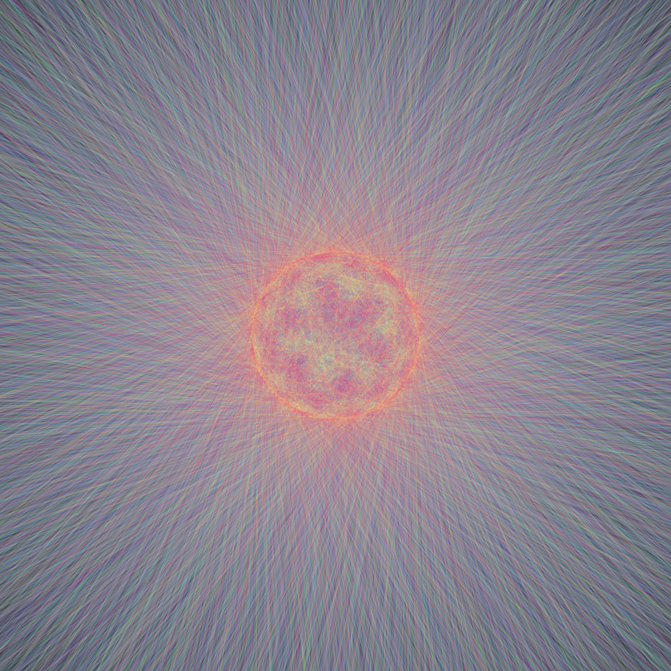
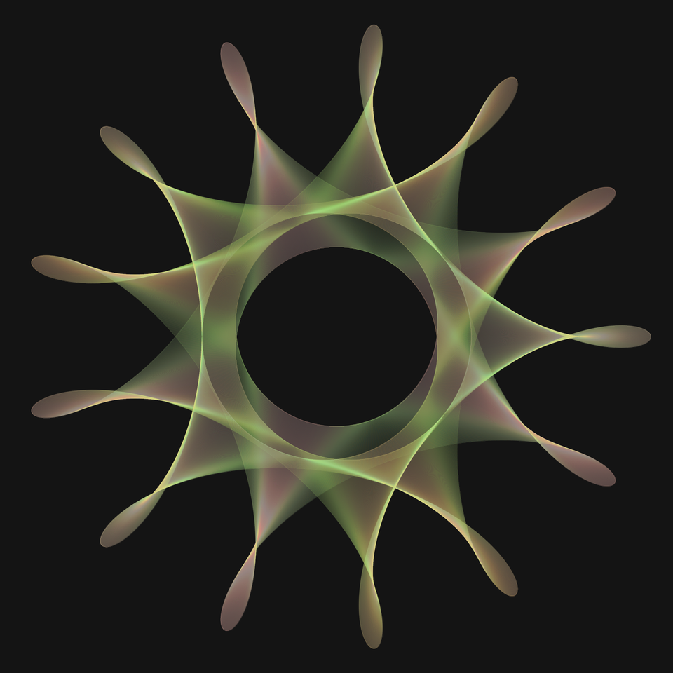
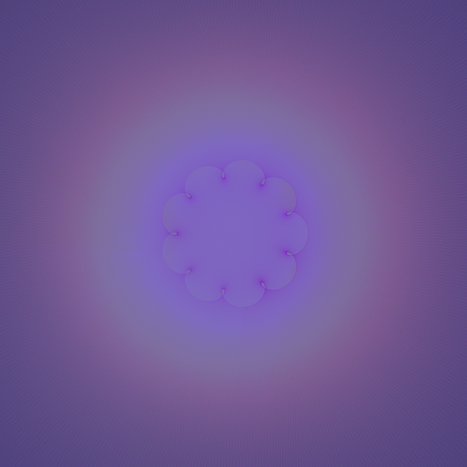
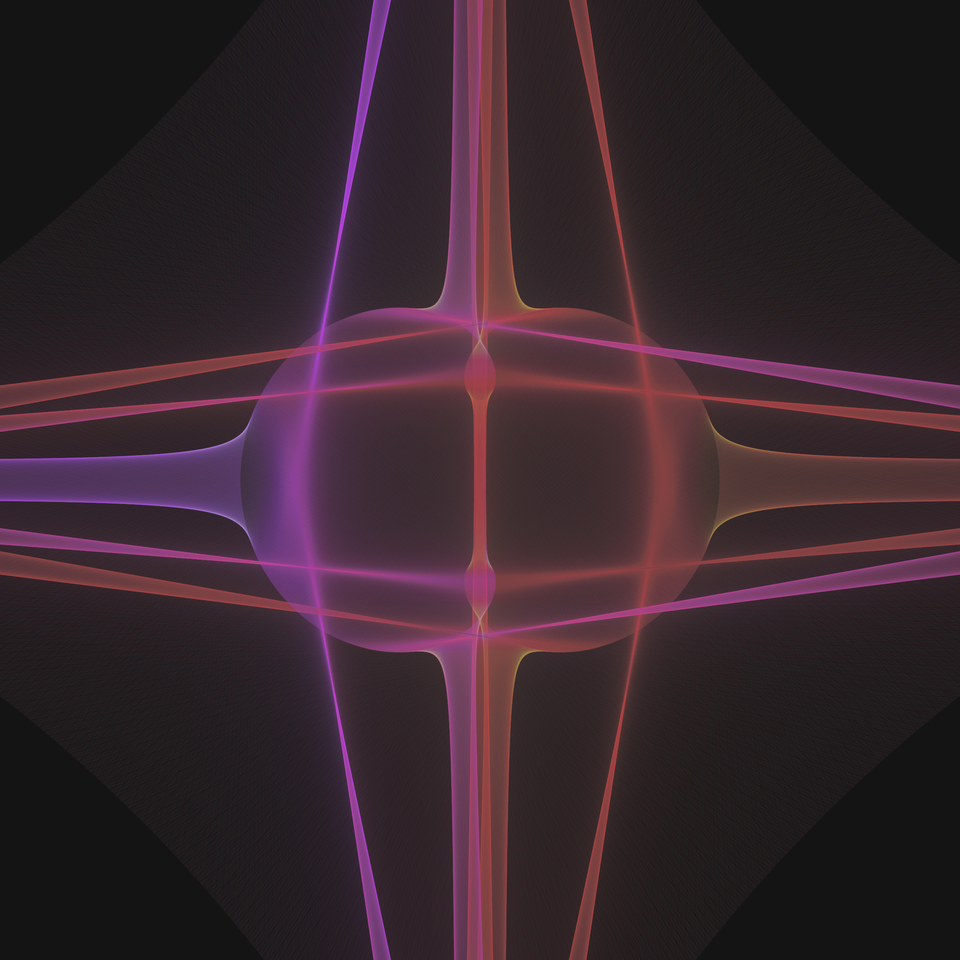
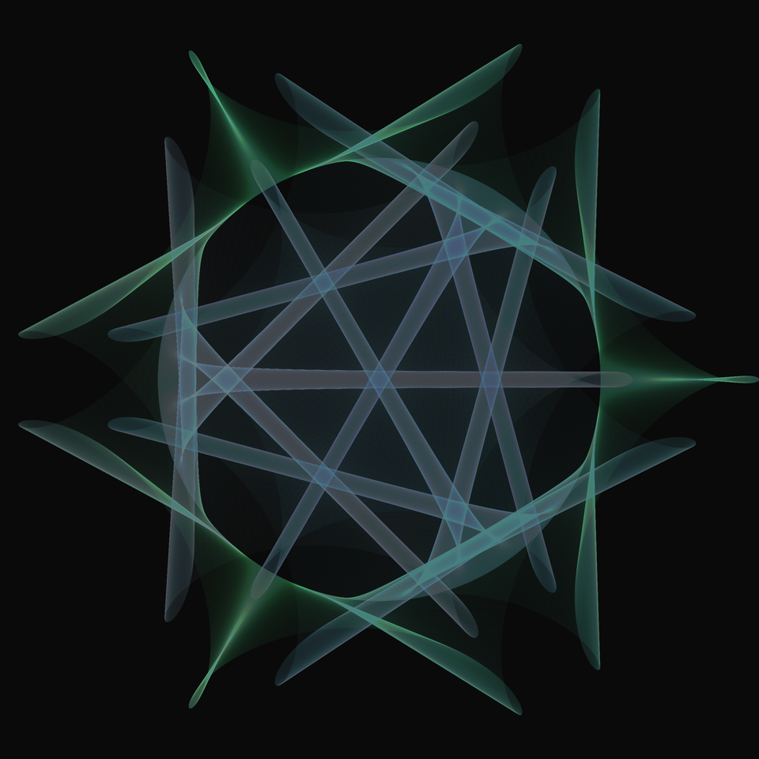
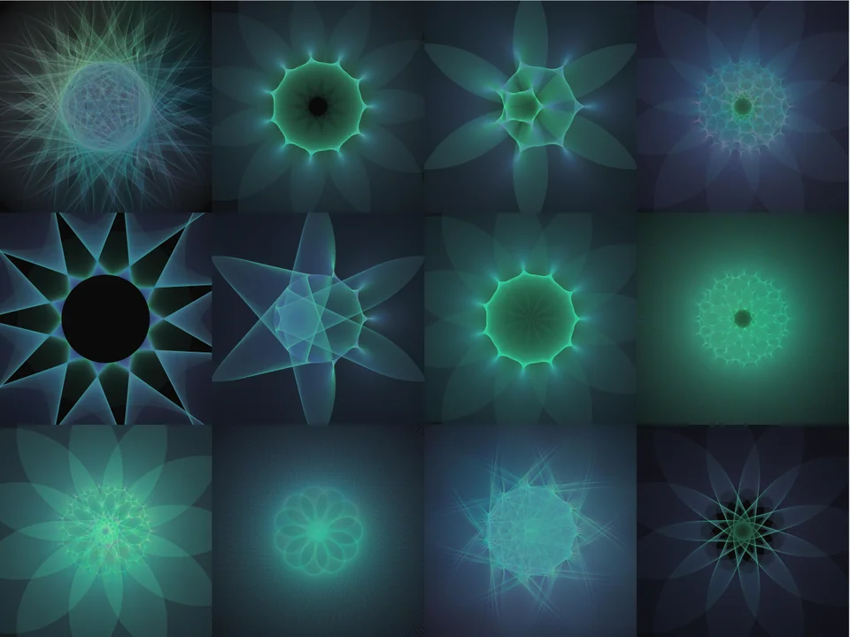

# References

## Orbits in orbits

>I calculate two circular orbits at different speeds and draw a line with high transparency between the "planets". For extra fun, the inner planet is orbiting around a center that is itself in orbit. in p5.js

<cite>by [r/ejgen](https://www.reddit.com/user/ejgen/) in [Reddit](https://www.reddit.com/r/generative/comments/jqiv25/orbits_in_orbits/?utm_source=share&utm_medium=web2x&context=3)</cite>

## Miasma

>As in the previous post, this is from drawing lines of high transparency between two "planets" in different orbits, in p5.js.

<cite>by [r/ejgen](https://www.reddit.com/user/ejgen/) in [Reddit](https://www.reddit.com/r/generative/comments/jqq54t/miasma/)</cite>

## All seeing eye

>I continue to draw high-transparency lines between planets orbiting stars that are also in orbit. Here I am using a color map that changes with the distance between the planets. In p5.js

<cite>by [r/ejgen](https://www.reddit.com/user/ejgen/) in [Reddit](https://www.reddit.com/r/generative/comments/jsgdgk/allseeing_eye/)</cite>

## The past was once the future

>More studies of drawing lines between planets orbiting suns which are themselves in orbit. It is a complex system that sometimes generates vastly different forms with small parameter changes and other times produces small variants over a wide range of parameters. In p5.js

<cite>by [r/ejgen](https://www.reddit.com/user/ejgen/) in [Reddit](https://www.reddit.com/r/generative/comments/jtcm2a/the_past_was_once_the_future/)</cite>

## Alien heart

>Drawing high-transparency lines between planets orbiting suns that are themselves in orbit. In this, one of the orbits is a very high radius compared to the others, creating linear forms. IN p5.js

<cite>by [r/ejgen](https://www.reddit.com/user/ejgen/) in [Reddit](https://www.reddit.com/r/generative/comments/ju82m3/alien_heart/)</cite>

## Needle and the damage done

>More plotting high-transparency lines between orbits. In p5.js.

<cite>by [r/ejgen](https://www.reddit.com/user/ejgen/) in [Reddit](https://www.reddit.com/r/generative/comments/jv0upw/needle_and_the_damage_done/)</cite>

## Twelve flowers from orbit

>Some variations of drawing high-transparency lines between planets orbiting suns which are themselves in orbit. Here I vary the speed and orbital velocity of one planet while holding the other constant to create variants on a flower theme. In p5.js.

>I seem to be stuck in a retro vibe! This https://www.reddit.com/r/generative/comments/j00ovr/soul_mates_2_degenerative_friday/ was compared to a Laser Tag carpet from decades ago.

<cite>by [r/ejgen](https://www.reddit.com/user/ejgen/) in [Reddit](https://www.reddit.com/r/generative/comments/jvzhgw/twelve_flowers_from_orbit/)</cite>

## Five candles for peace

>I continue to draw high-transparency lines between planets rotating suns that are themselves in orbit. Here I make the amazing conceptual breakthrough that the planets can rotate in opposite directions :-) so some new shapes are available. In p5.js

<cite>by [r/ejgen](https://www.reddit.com/user/ejgen/) in [Reddit](https://www.reddit.com/r/generative/comments/jr7os2/five_candles_for_peace/)</cite>