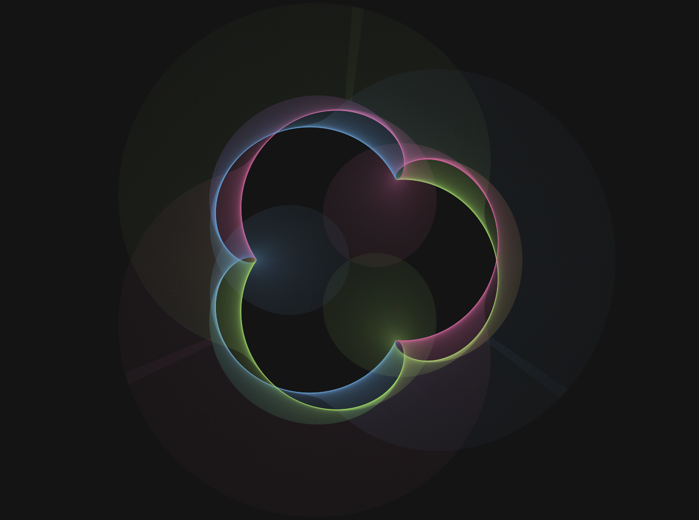

# Figures descobertes

Resum de les formes més maques descobertes juntament amb el que cal afegir a la funció `loadPlanets()` per aconseguir-les:

<style>img{width:500px}</style>

## Basic

Aquest és el model per defecte del programa.


```js
function loadPlanets() {
	const cont = document.getElementById('sliderContainer');
	sun = new Planet(cont, 1, 0, 60);
	sun.setOrbitCenter( createVector(CANVAS_WIDTH * .5, CANVAS_HEIGHT * .5 ));

	var earth, moon;

	earth = new Planet(cont, 500, .001, 120);
	moon = new Planet(cont, 350, .004, 180);
	earth.addSatellite( moon );
	sun.addSatellite( earth );
	unions.push([earth, moon]);
}
```

## CMY Eye


```js
function loadPlanets() {
	const cont = document.getElementById('sliderContainer');
	sun = new Planet(cont, 1, 0, 60);
	sun.setOrbitCenter( createVector(CANVAS_WIDTH * .5, CANVAS_HEIGHT * .5 ));

	var earth, moon;

	earth = new Planet(cont, 500, .001, 120);
	moon = new Planet(cont, 350, .004, 180);//cyan
	earth.addSatellite( moon );
	sun.addSatellite( earth );
	unions.push([earth, moon]);

	earth = new Planet(cont, 500, .001, 120);
	earth.setFase(TAU/1.5);
	moon = new Planet(cont, 350, .004, 60);//yellow
	earth.addSatellite( moon );
	sun.addSatellite( earth );
	unions.push([earth, moon]);

	earth = new Planet(cont, 500, .001, 120);
	earth.setFase(TAU/3);
	moon = new Planet(cont, 350, .004, 300);//magenta
	earth.addSatellite( moon );
	sun.addSatellite( earth );
	unions.push([earth, moon]);
}
```

## Trisquel


```js
function loadPlanets() {
	const cont = document.getElementById('sliderContainer');
	sun = new Planet(cont, 0, 0, 0);
	sun.setOrbitCenter( createVector(CANVAS_WIDTH * .5, CANVAS_HEIGHT * .5 ));

	var earth, moon, submoon;

	earth = new Planet(cont, 500, .001, 120);
	earth.setFase(0);
	sun.addSatellite( earth );
	moon = new Planet(cont, 350, .004, 180);//cyan
	moon.setFase(0);
	earth.addSatellite( moon );
	submoon = new Planet(cont, 150, .002, 210);
	submoon.setFase(0);
	moon.addSatellite( submoon );
	unions.push([moon, submoon]);

	earth = new Planet(cont, 500, .001, 120);
	earth.setFase(TAU/1.5);
	sun.addSatellite( earth );
	moon = new Planet(cont, 350, .004, 60);//yellow
	moon.setFase(TAU/1.5);
	earth.addSatellite( moon );
	submoon = new Planet(cont, 150, .002, 90);
	submoon.setFase(TAU/1.5);
	moon.addSatellite( submoon );
	unions.push([moon, submoon]);

	earth = new Planet(cont, 500, .001, 120);
	earth.setFase(TAU/3);
	sun.addSatellite( earth );
	moon = new Planet(cont, 350, .004, 300);//magenta
	moon.setFase(TAU/3);
	earth.addSatellite( moon );
	submoon = new Planet(cont, 150, .002, 330);
	submoon.setFase(TAU/3);
	moon.addSatellite( submoon );
	unions.push([moon, submoon]);
}
```

## Tri



```js
function loadPlanets() {
	const cont = document.getElementById('sliderContainer');
	sun = new Planet(cont, 0, 0, 0);
	sun.setOrbitCenter( createVector(CANVAS_WIDTH * .5, CANVAS_HEIGHT * .5 ));

	var earth, moon, submoon;

	earth = new Planet(cont, 500, .001, 120);
	earth.setFase(0);
	sun.addSatellite( earth );
	moon = new Planet(cont, 150, .004, 180);//cyan
	moon.setFase(0);
	earth.addSatellite( moon );
	submoon = new Planet(cont, 350, .002, 210);
	submoon.setFase(0);
	moon.addSatellite( submoon );
	unions.push([moon, submoon]);

	earth = new Planet(cont, 500, .001, 120);
	earth.setFase(TAU/1.5);
	sun.addSatellite( earth );
	moon = new Planet(cont, 150, .004, 60);//yellow
	moon.setFase(TAU/1.5);
	earth.addSatellite( moon );
	submoon = new Planet(cont, 350, .002, 90);
	submoon.setFase(TAU/1.5);
	moon.addSatellite( submoon );
	unions.push([moon, submoon]);

	earth = new Planet(cont, 500, .001, 120);
	earth.setFase(TAU/3);
	sun.addSatellite( earth );
	moon = new Planet(cont, 150, .004, 300);//magenta
	moon.setFase(TAU/3);
	earth.addSatellite( moon );
	submoon = new Planet(cont, 350, .002, 330);
	submoon.setFase(TAU/3);
	moon.addSatellite( submoon );
	unions.push([moon, submoon]);

	showHelper = true;
}
```

<!--

## xxx


```js
function loadPlanets() {
	const cont = document.getElementById('sliderContainer');
	sun = new Planet(cont, 0, 0, 0);
	sun.setOrbitCenter( createVector(CANVAS_WIDTH * .5, CANVAS_HEIGHT * .5 ));

	var earth, moon, submoon;

	//...
}
```

-->