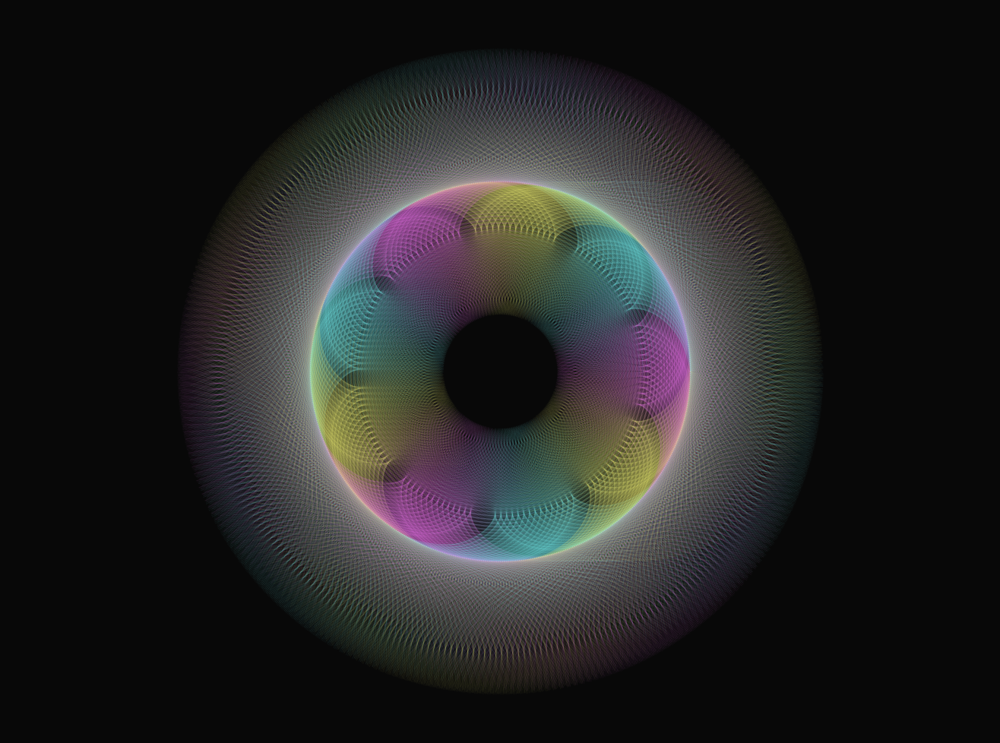

# Figures descobertes

Resum de les formes més maques descobertes juntament amb el que cal afegir a la funció `loadPlanets()` per aconseguir-les:

<style>img{width:500px}</style>

## Basic

Aquest és el model per defecte del programa.


```js
function loadPlanets() {
	const cont = document.getElementById('sliderContainer');
	sun = new Planet(cont, 1, 0, 60);
	sun.setOrbitCenter( createVector(CANVAS_WIDTH * .5, CANVAS_HEIGHT * .5 ));

	var earth, moon;

	earth = new Planet(cont, 500, .01, 120);
	moon = new Planet(cont, 350, .04, 180);
	earth.addSatellite( moon );
	sun.addSatellite( earth );
	unions.push([earth, moon]);
}
```

## CMY Flower



```js
function loadPlanets() {
	const cont = document.getElementById('sliderContainer');
	sun = new Planet(cont, 1, 0, 60);
	sun.setOrbitCenter( createVector(CANVAS_WIDTH * .5, CANVAS_HEIGHT * .5 ));

	var earth, moon;

	earth = new Planet(cont, 500, .01, 120);
	moon = new Planet(cont, 350, .04, 180);
	earth.addSatellite( moon );
	sun.addSatellite( earth );
	unions.push([earth, moon]);

	earth = new Planet(cont, 500, .01, 120);
	earth.setFase(TAU/1.5);
	moon = new Planet(cont, 350, .04, 60);
	earth.addSatellite( moon );
	sun.addSatellite( earth );
	unions.push([earth, moon]);

	earth = new Planet(cont, 500, .01, 120);
	earth.setFase(TAU/3);
	moon = new Planet(cont, 350, .04, 300);
	earth.addSatellite( moon );
	sun.addSatellite( earth );
	unions.push([earth, moon]);
}
```