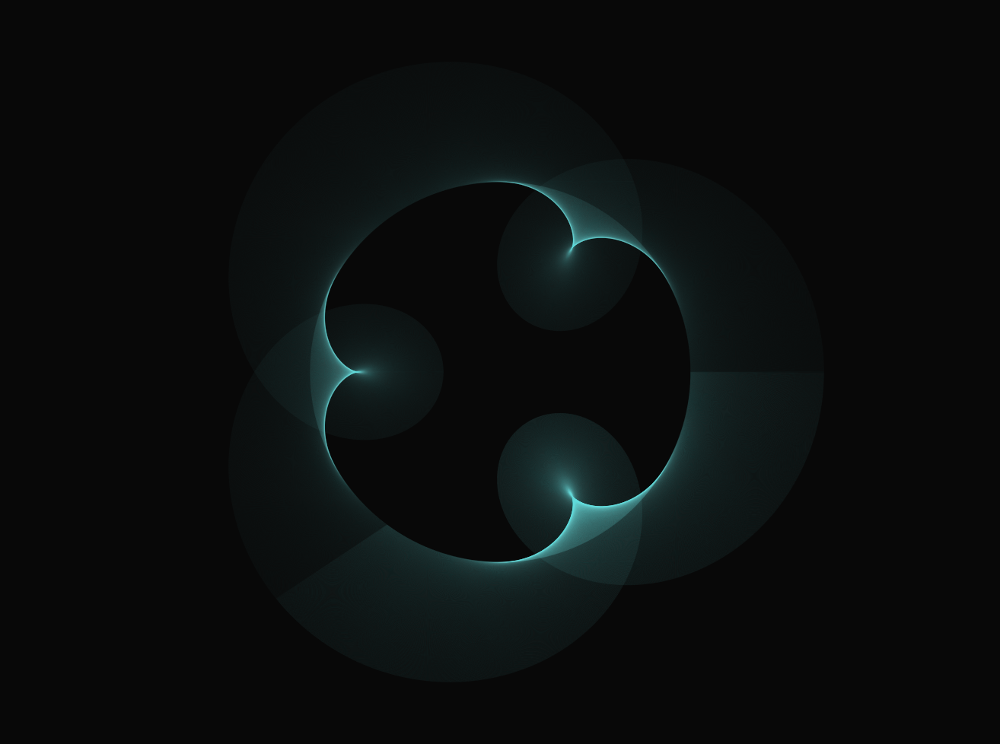
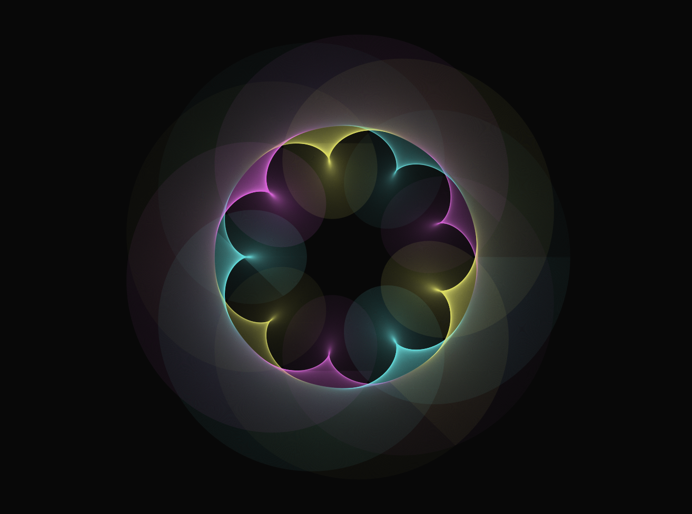
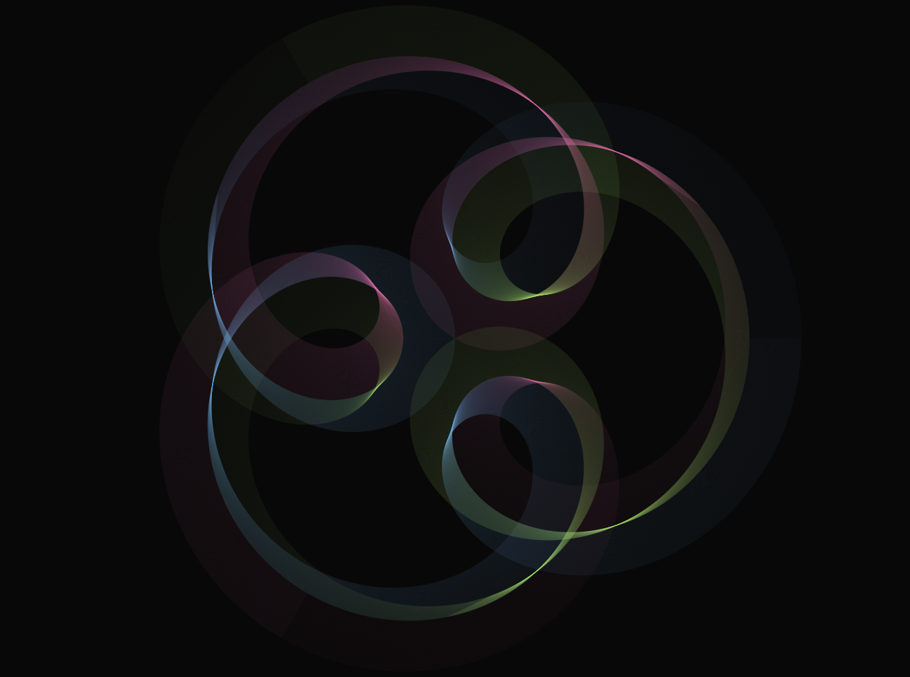
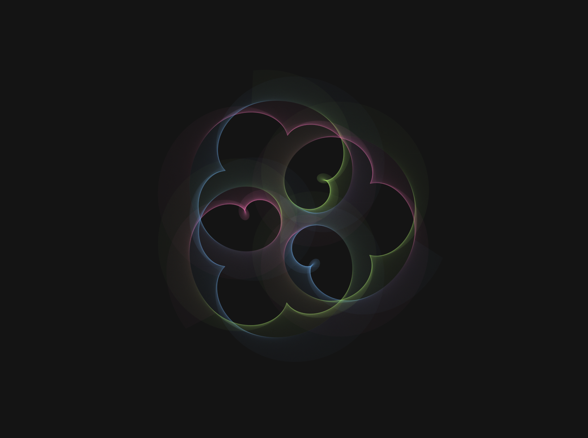
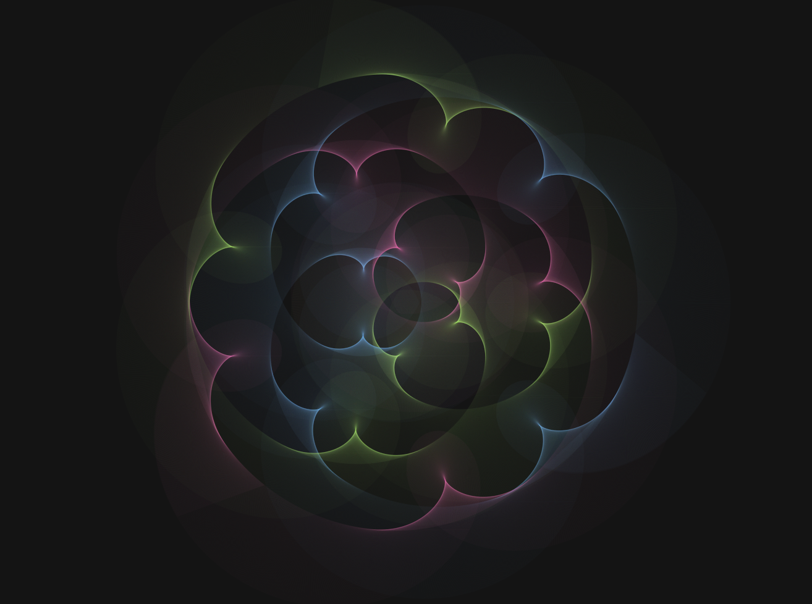
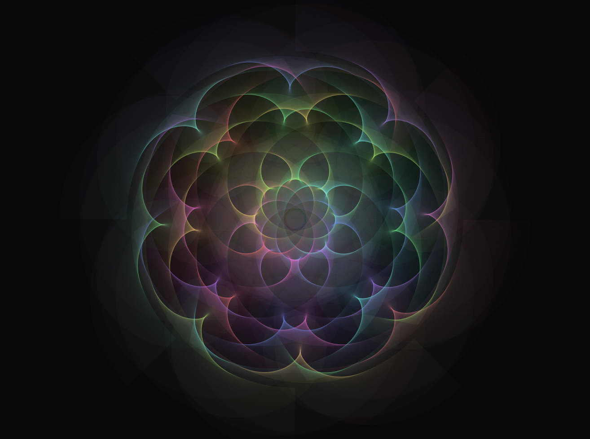
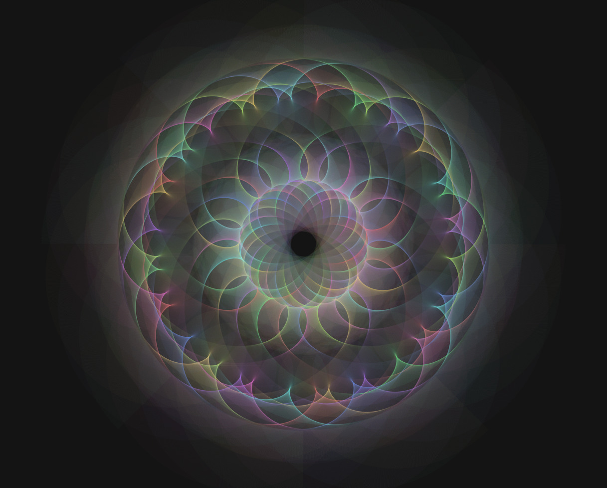
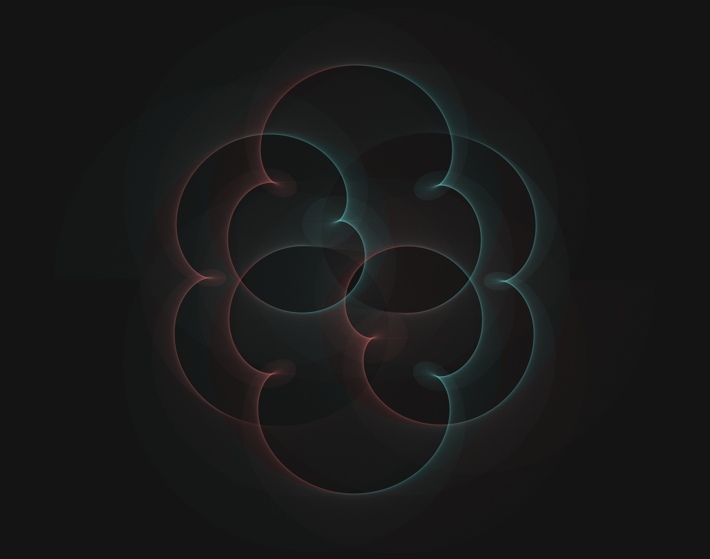
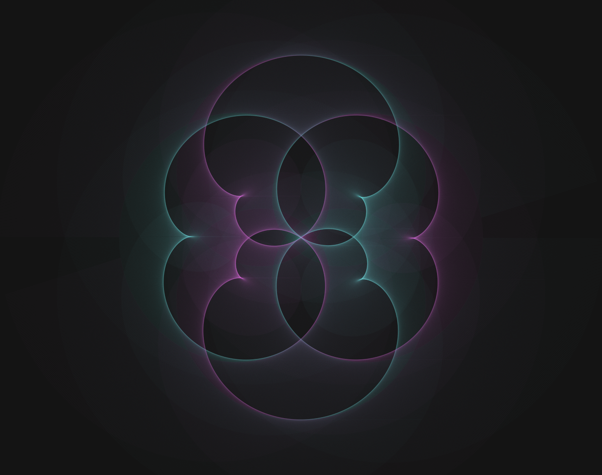
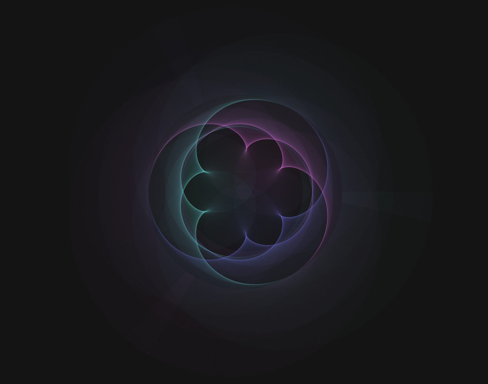

# Figures descobertes

Resum de les formes més maques descobertes juntament amb el codi que cal executar a la consola del navegador per aconseguir-les:

<style> img, iframe { width: 750px; display: block; margin: 0 auto; } </style>

## Basic

Aquest és el model per defecte del programa.




```js
{
	const cont = document.getElementById('sliderContainer');
	sun = new Planet(cont, 1, 0, 60);
	sun.setOrbitCenter( createVector(CANVAS_WIDTH * .5, CANVAS_HEIGHT * .5 ));
	unions = [];

	var earth, moon;

	earth = new Planet(cont, 500, .001, 120);
	moon = new Planet(cont, 350, .004, 180);
	earth.addSatellite( moon );
	sun.addSatellite( earth );
	unions.push([earth, moon]);

	clearCanvas();
}
```

## CMY Eye



```js
{
	const cont = document.getElementById('sliderContainer');
	sun = new Planet(cont, 1, 0, 60);
	sun.setOrbitCenter( createVector(CANVAS_WIDTH * .5, CANVAS_HEIGHT * .5 ));
	unions = [];

	var earth, moon;

	earth = new Planet(cont, 500, .001, 120);
	moon = new Planet(cont, 350, .004, 180);//cyan
	earth.addSatellite( moon );
	sun.addSatellite( earth );
	unions.push([earth, moon]);

	earth = new Planet(cont, 500, .001, 120);
	earth.setFase(TAU/1.5);
	moon = new Planet(cont, 350, .004, 60);//yellow
	earth.addSatellite( moon );
	sun.addSatellite( earth );
	unions.push([earth, moon]);

	earth = new Planet(cont, 500, .001, 120);
	earth.setFase(TAU/3);
	moon = new Planet(cont, 350, .004, 300);//magenta
	earth.addSatellite( moon );
	sun.addSatellite( earth );
	unions.push([earth, moon]);

	clearCanvas();
}
```

## Trisquel



```js
{
	const cont = document.getElementById('sliderContainer');
	sun = new Planet(cont, 0, 0, 0);
	sun.setOrbitCenter( createVector(CANVAS_WIDTH * .5, CANVAS_HEIGHT * .5 ));
	unions = [];

	var earth, moon, submoon;

	earth = new Planet(cont, 500, .001, 120);
	earth.setFase(0);
	sun.addSatellite( earth );
	moon = new Planet(cont, 350, .004, 180);//cyan
	moon.setFase(0);
	earth.addSatellite( moon );
	submoon = new Planet(cont, 150, .002, 210);
	submoon.setFase(0);
	moon.addSatellite( submoon );
	unions.push([moon, submoon]);

	earth = new Planet(cont, 500, .001, 120);
	earth.setFase(TAU/1.5);
	sun.addSatellite( earth );
	moon = new Planet(cont, 350, .004, 60);//yellow
	moon.setFase(TAU/1.5);
	earth.addSatellite( moon );
	submoon = new Planet(cont, 150, .002, 90);
	submoon.setFase(TAU/1.5);
	moon.addSatellite( submoon );
	unions.push([moon, submoon]);

	earth = new Planet(cont, 500, .001, 120);
	earth.setFase(TAU/3);
	sun.addSatellite( earth );
	moon = new Planet(cont, 350, .004, 300);//magenta
	moon.setFase(TAU/3);
	earth.addSatellite( moon );
	submoon = new Planet(cont, 150, .002, 330);
	submoon.setFase(TAU/3);
	moon.addSatellite( submoon );
	unions.push([moon, submoon]);

	clearCanvas();
}
```

## Trinquete Cloud


```js
{
	const cont = document.getElementById('sliderContainer');
	sun = new Planet(cont, 0, 0, 0);
	sun.setOrbitCenter( createVector(CANVAS_WIDTH * .5, CANVAS_HEIGHT * .5 ));
	unions = [];

	var earth, moon, submoon;

	earth = new Planet(cont, 500, .001, 120);
	earth.setFase(0);
	sun.addSatellite( earth );
	moon = new Planet(cont, 150, .004, 180);//cyan
	moon.setFase(0);
	earth.addSatellite( moon );
	submoon = new Planet(cont, 350, .002, 210);
	submoon.setFase(0);
	moon.addSatellite( submoon );
	unions.push([moon, submoon]);

	earth = new Planet(cont, 500, .001, 120);
	earth.setFase(TAU/1.5);
	sun.addSatellite( earth );
	moon = new Planet(cont, 150, .004, 60);//yellow
	moon.setFase(TAU/1.5);
	earth.addSatellite( moon );
	submoon = new Planet(cont, 350, .002, 90);
	submoon.setFase(TAU/1.5);
	moon.addSatellite( submoon );
	unions.push([moon, submoon]);

	earth = new Planet(cont, 500, .001, 120);
	earth.setFase(TAU/3);
	sun.addSatellite( earth );
	moon = new Planet(cont, 150, .004, 300);//magenta
	moon.setFase(TAU/3);
	earth.addSatellite( moon );
	submoon = new Planet(cont, 350, .002, 330);
	submoon.setFase(TAU/3);
	moon.addSatellite( submoon );
	unions.push([moon, submoon]);

	clearCanvas();
}
```

## TriCloud



```js
{

	const COLOR1 = 180 ; // cyan
	const COLOR2 = 60  ; // yellow
	const COLOR3 = 300 ; // magenta

	const EARTH_RADIUS   =   300 ;	const EARTH_SPEED    =  .001 ;
	const MOON_RADIUS    =   250 ;	const MOON_SPEED     =  .004 ;
	const SUBMOON_RADIUS =   150 ;	const SUBMOON_SPEED  =  .008 ;

	const cont = document.getElementById('sliderContainer');
	sun = new Planet(cont, 0, 0, 0);
	sun.setOrbitCenter( createVector(CANVAS_WIDTH * .5, CANVAS_HEIGHT * .5 ));
	unions = [];

	var earth, moon, submoon;

	earth = new Planet(cont, EARTH_RADIUS, EARTH_SPEED, 120);
	earth.setFase(0);
	sun.addSatellite( earth );
	moon = new Planet(cont, MOON_RADIUS, MOON_SPEED, COLOR1);
	moon.setFase(0);
	earth.addSatellite( moon );
	submoon = new Planet(cont, SUBMOON_RADIUS, SUBMOON_SPEED, 210);
	submoon.setFase(0);
	moon.addSatellite( submoon );
	unions.push([moon, submoon]);

	earth = new Planet(cont, EARTH_RADIUS, EARTH_SPEED, 120);
	earth.setFase(TAU/1.5);
	sun.addSatellite( earth );
	moon = new Planet(cont, MOON_RADIUS, MOON_SPEED, COLOR2);
	moon.setFase(TAU/1.5);
	earth.addSatellite( moon );
	submoon = new Planet(cont, SUBMOON_RADIUS, SUBMOON_SPEED, 90);
	submoon.setFase(TAU/1.5);
	moon.addSatellite( submoon );
	unions.push([moon, submoon]);

	earth = new Planet(cont, EARTH_RADIUS, EARTH_SPEED, 120);
	earth.setFase(TAU/3);
	sun.addSatellite( earth );
	moon = new Planet(cont, MOON_RADIUS, MOON_SPEED, COLOR3);
	moon.setFase(TAU/3);
	earth.addSatellite( moon );
	submoon = new Planet(cont, SUBMOON_RADIUS, SUBMOON_SPEED, 330);
	submoon.setFase(TAU/3);
	moon.addSatellite( submoon );
	unions.push([moon, submoon]);

	clearCanvas();
}
```

## Trinity



```js
{

	const COLOR1 = 180 ; //cyan
	const COLOR2 = 60  ; //yellow
	const COLOR3 = 300 ; //magenta

	const EARTH_RADIUS   =   350 ;	const EARTH_SPEED    =  .001 ;
	const MOON_RADIUS    =   400 ;	const MOON_SPEED     =  .002 ;
	const SUBMOON_RADIUS =   300 ;	const SUBMOON_SPEED  =  .008 ;

	const cont = document.getElementById('sliderContainer');
	sun = new Planet(cont, 0, 0, 0);
	sun.setOrbitCenter( createVector(CANVAS_WIDTH * .5, CANVAS_HEIGHT * .5 ));
	unions = [];

	var earth, moon, submoon;

	earth = new Planet(cont, EARTH_RADIUS, EARTH_SPEED, 120);
	earth.setFase(0);
	sun.addSatellite( earth );
	moon = new Planet(cont, MOON_RADIUS, MOON_SPEED, COLOR1);
	moon.setFase(0);
	earth.addSatellite( moon );
	submoon = new Planet(cont, SUBMOON_RADIUS, SUBMOON_SPEED, 210);
	submoon.setFase(0);
	moon.addSatellite( submoon );
	unions.push([moon, submoon]);

	earth = new Planet(cont, EARTH_RADIUS, EARTH_SPEED, 120);
	earth.setFase(TAU/1.5);
	sun.addSatellite( earth );
	moon = new Planet(cont, MOON_RADIUS, MOON_SPEED, COLOR2);
	moon.setFase(TAU/1.5);
	earth.addSatellite( moon );
	submoon = new Planet(cont, SUBMOON_RADIUS, SUBMOON_SPEED, 90);
	submoon.setFase(TAU/1.5);
	moon.addSatellite( submoon );
	unions.push([moon, submoon]);

	earth = new Planet(cont, EARTH_RADIUS, EARTH_SPEED, 120);
	earth.setFase(TAU/3);
	sun.addSatellite( earth );
	moon = new Planet(cont, MOON_RADIUS, MOON_SPEED, COLOR3);
	moon.setFase(TAU/3);
	earth.addSatellite( moon );
	submoon = new Planet(cont, SUBMOON_RADIUS, SUBMOON_SPEED, 330);
	submoon.setFase(TAU/3);
	moon.addSatellite( submoon );
	unions.push([moon, submoon]);

	clearCanvas();
}
```

## Octinity

<!--  -->

<iframe width="560" height="315" src="https://www.youtube.com/embed/V44QqkWBY2s?controls=0" frameborder="0" allow="accelerometer; autoplay; clipboard-write; encrypted-media; gyroscope; picture-in-picture" allowfullscreen></iframe>

```js
{
	const cont = document.getElementById('sliderContainer');
	sun = new Planet(cont, 0, 0, 0);
	sun.setOrbitCenter( createVector(CANVAS_WIDTH * .5, CANVAS_HEIGHT * .5 ));
	unions = [];

	const n = 8;

	const EARTH_RADIUS   =   350 ;	const EARTH_SPEED    =  .001 ;
	const MOON_RADIUS    =   400 ;	const MOON_SPEED     =  .002 ;
	const SUBMOON_RADIUS =   300 ;	const SUBMOON_SPEED  =  .008 ;

	const INCR_ANGLE = TAU/n;
	const INCR_COLOR = 360/n;

	var earth, moon, submoon;
	var angle = 0;
	var colorHue = 0;

	for (let i = 0; i < n; i++) {
		earth = new Planet(cont, EARTH_RADIUS, EARTH_SPEED, 120);
		earth.setFase(angle);
		sun.addSatellite( earth );

		moon = new Planet(cont, MOON_RADIUS, MOON_SPEED, colorHue);
		moon.setFase(angle);
		earth.addSatellite( moon );

		submoon = new Planet(cont, SUBMOON_RADIUS, SUBMOON_SPEED, colorHue);
		submoon.setFase(angle);
		moon.addSatellite( submoon );

		unions.push([moon, submoon]);

		angle += INCR_ANGLE;
		colorHue += INCR_COLOR;
	}
  
  clearCanvas();
}
```

## Rabbit Hole



```js
{
	const cont = document.getElementById('sliderContainer');
	sun = new Planet(cont, 0, 0, 0);
	sun.setOrbitCenter( createVector(CANVAS_WIDTH * .5, CANVAS_HEIGHT * .5 ));
	unions = [];

	const n = 8;

	const EARTH_RADIUS   =   350 ;	const EARTH_SPEED    =  .0005 ;
	const MOON_RADIUS    =   400 ;	const MOON_SPEED     =  .002 ;
	const SUBMOON_RADIUS =   300 ;	const SUBMOON_SPEED  =  .008 ;

	const INCR_ANGLE = TAU/n;
	const INCR_COLOR = 360/n;

	var earth, moon, submoon;
	var angle = 0;
	var colorHue = 0;

	for (let i = 0; i < n; i++) {
		earth = new Planet(cont, EARTH_RADIUS, EARTH_SPEED, 120);
		earth.setFase(angle);
		sun.addSatellite( earth );

		moon = new Planet(cont, MOON_RADIUS, MOON_SPEED, colorHue);
		moon.setFase(angle);
		earth.addSatellite( moon );

		submoon = new Planet(cont, SUBMOON_RADIUS, SUBMOON_SPEED, colorHue);
		submoon.setFase(angle);
		moon.addSatellite( submoon );

		unions.push([moon, submoon]);

		angle += INCR_ANGLE;
		colorHue += INCR_COLOR;
	}
  
  clearCanvas();
}
```

## U&Me



```js
{
	const cont = document.getElementById('sliderContainer');
	sun = new Planet(cont, 0, 0, 0);
	sun.setOrbitCenter( createVector(CANVAS_WIDTH * .5, CANVAS_HEIGHT * .5 ));
	unions = [];

	const n = 2;

	const EARTH_RADIUS   =   350 ;	const EARTH_SPEED    =  .001 ;
	const MOON_RADIUS    =   400 ;	const MOON_SPEED     =  .005 ;
	const SUBMOON_RADIUS =   300 ;	const SUBMOON_SPEED  =  .010 ;

	const INCR_ANGLE = TAU/n;
	const INCR_COLOR = 360/n;

	var earth, moon, submoon;
	var angle = 0;
	var colorHue = 0;

	for (let i = 0; i < n; i++) {
		earth = new Planet(cont, EARTH_RADIUS, EARTH_SPEED, 120);
		earth.setFase(angle);
		sun.addSatellite( earth );

		moon = new Planet(cont, MOON_RADIUS, MOON_SPEED, colorHue);
		moon.setFase(angle);
		earth.addSatellite( moon );

		submoon = new Planet(cont, SUBMOON_RADIUS, SUBMOON_SPEED, colorHue);
		submoon.setFase(angle);
		moon.addSatellite( submoon );

		unions.push([moon, submoon]);

		angle += INCR_ANGLE;
		colorHue += INCR_COLOR;
	}
  
  clearCanvas();
}
```

## Me&Me



```js
{
	const cont = document.getElementById('sliderContainer');
	sun = new Planet(cont, 0, 0, 0);
	sun.setOrbitCenter( createVector(CANVAS_WIDTH * .5, CANVAS_HEIGHT * .5 ));
	unions = [];

	const EARTH_RADIUS   =   350 ;	const EARTH_SPEED    =  .001 ;
	const MOON_RADIUS    =   400 ;	const MOON_SPEED     =  .005 ;
	const SUBMOON_RADIUS =   500 ;	const SUBMOON_SPEED  =  .008 ;

	var colorHues = [180, 300];
  
	var earth, moon, submoon;
	var angle = 0;
	const INCR_ANGLE = TAU/colorHues.length;

	for (let i = 0; i < colorHues.length; i++) {
		earth = new Planet(cont, EARTH_RADIUS, EARTH_SPEED, 120);
		earth.setFase(angle);
		sun.addSatellite( earth );

		moon = new Planet(cont, MOON_RADIUS, MOON_SPEED, colorHues[i]);
		moon.setFase(angle);
		earth.addSatellite( moon );

		submoon = new Planet(cont, SUBMOON_RADIUS, SUBMOON_SPEED, colorHues[i]);
		submoon.setFase(angle);
		moon.addSatellite( submoon );

		unions.push([moon, submoon]);

		angle += INCR_ANGLE;
	}
  
  clearCanvas();
}
```

## Mar



```js
{
	const cont = document.getElementById('sliderContainer');
	sun = new Planet(cont, 0, 0, 0);
	sun.setOrbitCenter( createVector(CANVAS_WIDTH * .5, CANVAS_HEIGHT * .5 ));
	unions = [];

	const EARTH_RADIUS   =   100 ;	const EARTH_SPEED    =  .002 ;
	const MOON_RADIUS    =   400 ;	const MOON_SPEED     =  .004 ;
	const SUBMOON_RADIUS =   460 ;	const SUBMOON_SPEED  =  .008 ;

	var colorHues = [180, 300, 240];
  
	var earth, moon, submoon;
	var angle = 0;
	const INCR_ANGLE = TAU/colorHues.length;

	for (let i = 0; i < colorHues.length; i++) {
		earth = new Planet(cont, EARTH_RADIUS, EARTH_SPEED, 120);
		earth.setFase(angle);
		sun.addSatellite( earth );

		moon = new Planet(cont, MOON_RADIUS, MOON_SPEED, colorHues[i]);
		moon.setFase(angle);
		earth.addSatellite( moon );

		submoon = new Planet(cont, SUBMOON_RADIUS, SUBMOON_SPEED, colorHues[i]);
		submoon.setFase(angle);
		moon.addSatellite( submoon );

		unions.push([moon, submoon]);

		angle += INCR_ANGLE;
	}
  
  clearCanvas();
}
```
<!--

## xxx


```js
{
	const cont = document.getElementById('sliderContainer');
	sun = new Planet(cont, 0, 0, 0);
	sun.setOrbitCenter( createVector(CANVAS_WIDTH * .5, CANVAS_HEIGHT * .5 ));
	unions = [];

	var earth, moon, submoon;

	//...
	
	//showHelper = true;

	clearCanvas();
}
```

-->