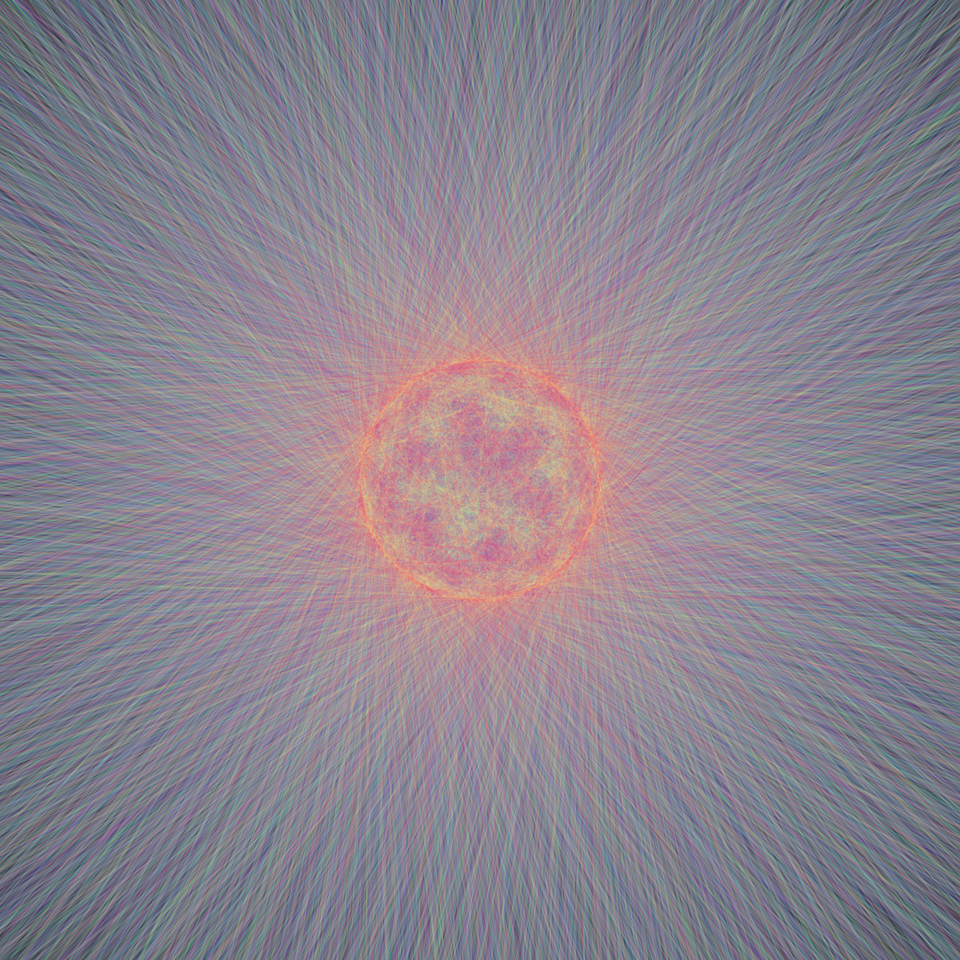
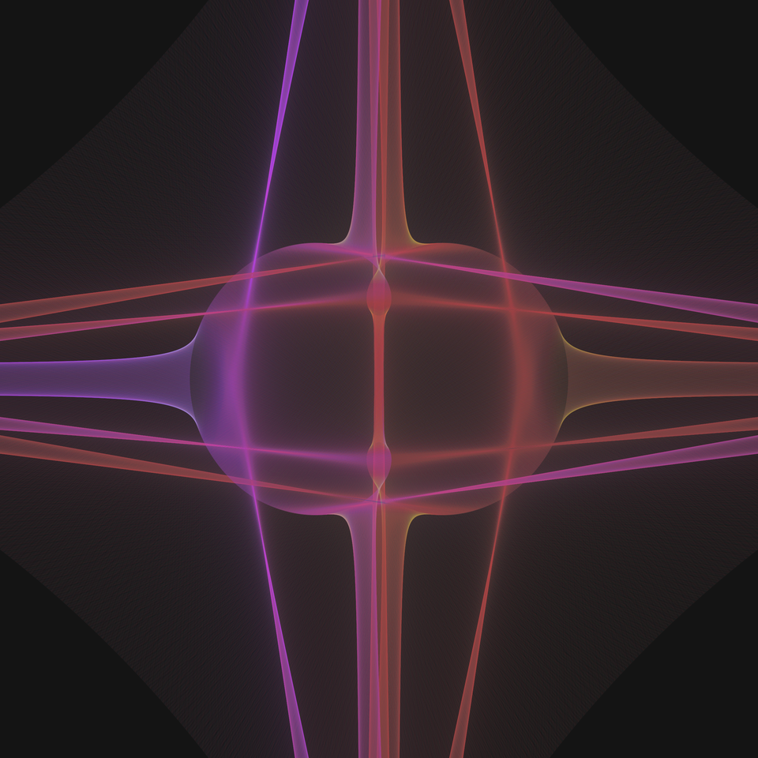
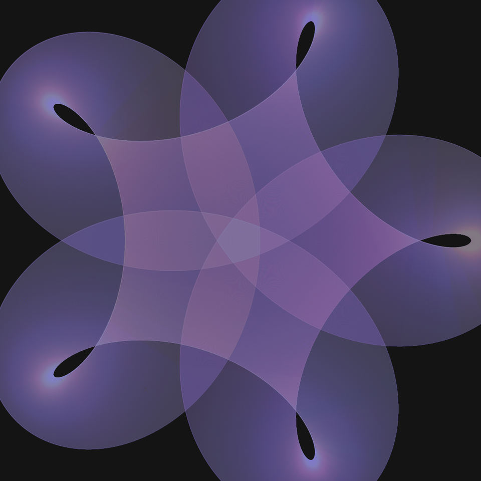
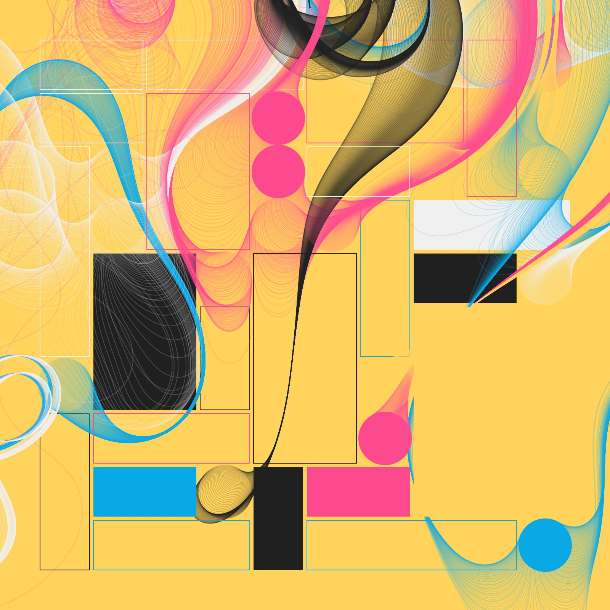
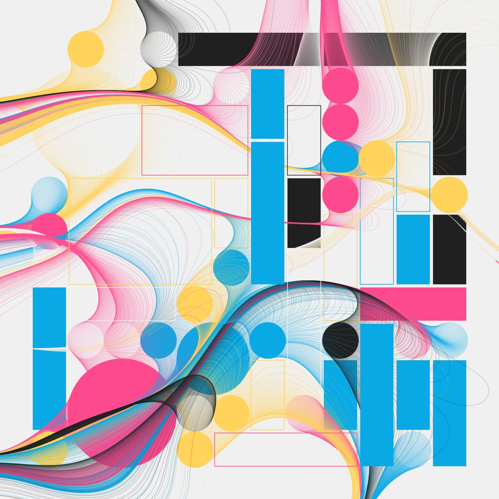
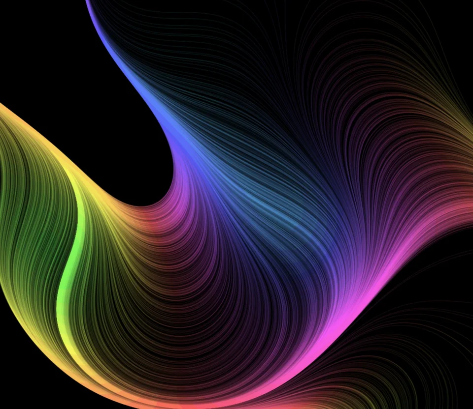
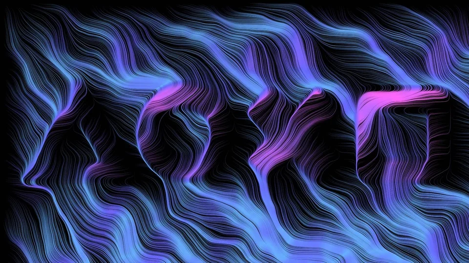
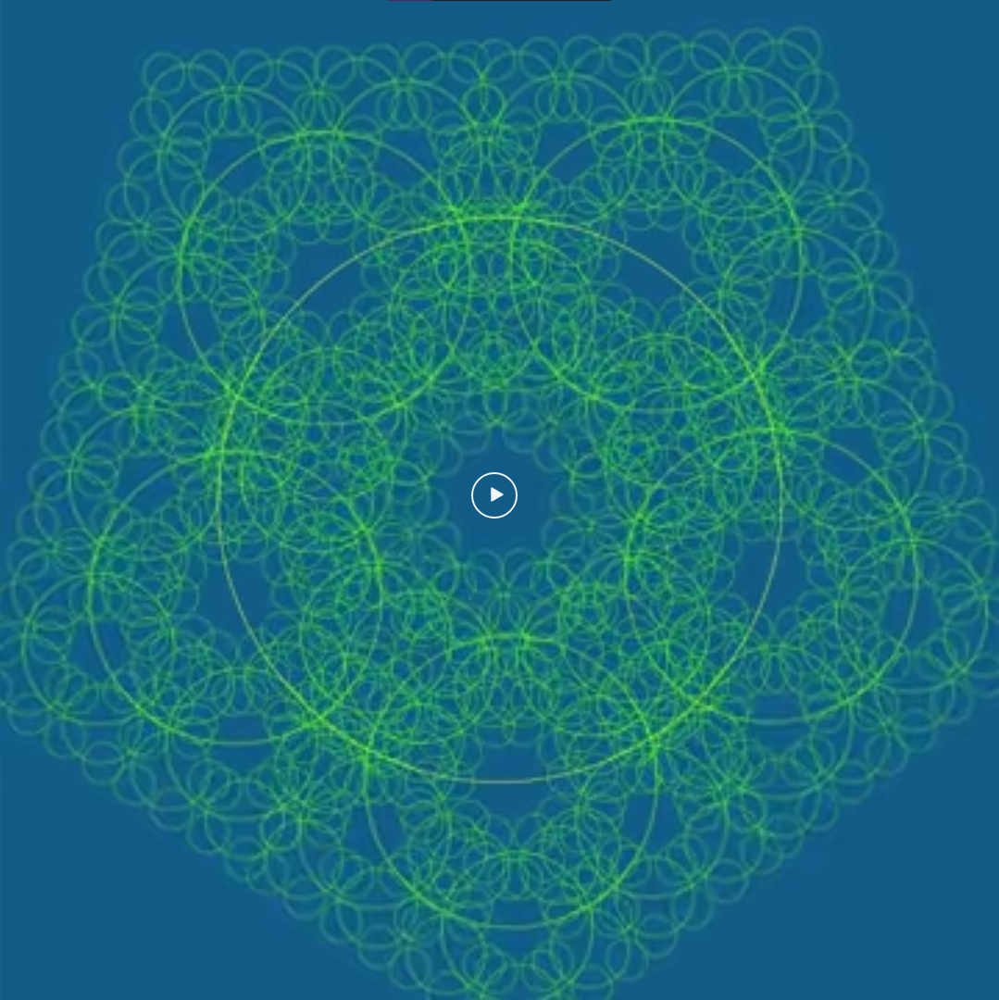
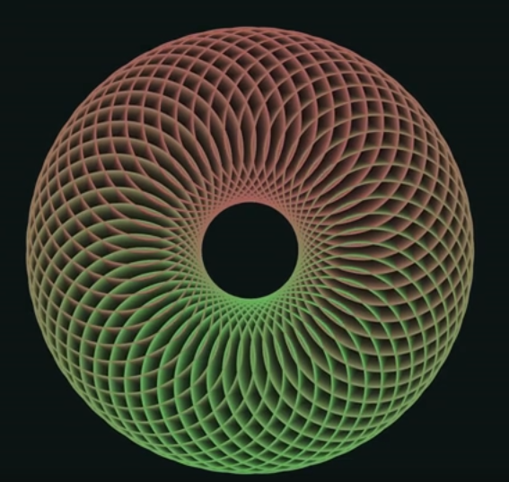
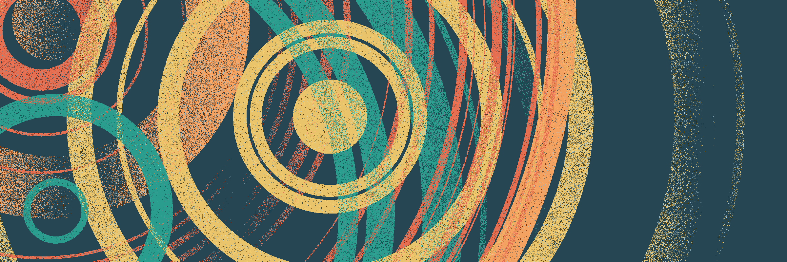

# References

## Orbit

### Orbits in orbits

>I calculate two circular orbits at different speeds and draw a line with high transparency between the "planets". For extra fun, the inner planet is orbiting around a center that is itself in orbit. in p5.js

<cite>by [u/ejgen](https://www.reddit.com/user/ejgen/) in [Reddit](https://www.reddit.com/r/generative/comments/jqiv25/orbits_in_orbits/?utm_source=share&utm_medium=web2x&context=3)</cite>

### Miasma

>As in the previous post, this is from drawing lines of high transparency between two "planets" in different orbits, in p5.js.

<cite>by [u/ejgen](https://www.reddit.com/user/ejgen/) in [Reddit](https://www.reddit.com/r/generative/comments/jqq54t/miasma/)</cite>

### All seeing eye

>I continue to draw high-transparency lines between planets orbiting stars that are also in orbit. Here I am using a color map that changes with the distance between the planets. In p5.js

<cite>by [u/ejgen](https://www.reddit.com/user/ejgen/) in [Reddit](https://www.reddit.com/r/generative/comments/jsgdgk/allseeing_eye/)</cite>

### The past was once the future

>More studies of drawing lines between planets orbiting suns which are themselves in orbit. It is a complex system that sometimes generates vastly different forms with small parameter changes and other times produces small variants over a wide range of parameters. In p5.js

<cite>by [u/ejgen](https://www.reddit.com/user/ejgen/) in [Reddit](https://www.reddit.com/r/generative/comments/jtcm2a/the_past_was_once_the_future/)</cite>

### Alien heart

>Drawing high-transparency lines between planets orbiting suns that are themselves in orbit. In this, one of the orbits is a very high radius compared to the others, creating linear forms. IN p5.js

<cite>by [u/ejgen](https://www.reddit.com/user/ejgen/) in [Reddit](https://www.reddit.com/r/generative/comments/ju82m3/alien_heart/)</cite>

### Needle and the damage done

>More plotting high-transparency lines between orbits. In p5.js.

<cite>by [u/ejgen](https://www.reddit.com/user/ejgen/) in [Reddit](https://www.reddit.com/r/generative/comments/jv0upw/needle_and_the_damage_done/)</cite>

### Twelve flowers from orbit

>Some variations of drawing high-transparency lines between planets orbiting suns which are themselves in orbit. Here I vary the speed and orbital velocity of one planet while holding the other constant to create variants on a flower theme. In p5.js.

>I seem to be stuck in a retro vibe! This https://www.reddit.com/r/generative/comments/j00ovr/soul_mates_2_degenerative_friday/ was compared to a Laser Tag carpet from decades ago.

<cite>by [u/ejgen](https://www.reddit.com/user/ejgen/) in [Reddit](https://www.reddit.com/r/generative/comments/jvzhgw/twelve_flowers_from_orbit/)</cite>

### Five candles for peace

>I continue to draw high-transparency lines between planets rotating suns that are themselves in orbit. Here I make the amazing conceptual breakthrough that the planets can rotate in opposite directions :-) so some new shapes are available. In p5.js

<cite>by [u/ejgen](https://www.reddit.com/user/ejgen/) in [Reddit](https://www.reddit.com/r/generative/comments/jr7os2/five_candles_for_peace/)</cite>

## Organic Painting

### Rhythm

>Thanks for the generative art history lesson u/dmitricherniak , always very curious on how techniques emerges 😊and astonished how peculiarly similar the pieces are !
>
>To further breakdown my piece:
>if you follow okazzsp code in tweet and play with noise parameters, beautiful branching like pattern emerges . some of his other artworks also have it.
>The original piece has algorithm for packing circles and rectangle together. i used only circles for packing as i had my own circle packing library https://github.com/shrynx/circle-packing, it follow simple growth algorithm but with lot of flexibility. ( and if you are wondering No! most of my code is never this well documented or structured 😛)originally this was written for a complete different piece and grew over time https://www.reddit.com/r/generative/comments/h15vcq/untitled/
>Following advice from tyler hobbs essays i chose non overlapping flow field starting points using circle packing
>
>Some circles are left empty, kept this stylistic choice from okazzsp and rest are filled with tiny circles. This was inspired from manoloide's mantel https://www.behance.net/gallery/62172035/mantel . Probably my all time favourite generative art piece.
>
>And finally the last piece of puzzle, i tried couple of palettes and settled oncolours from kandinsky's white zig zags.
>
>Hope this gives some insights to explore them further 😀

<cite>by [u/shrynx_1](https://www.reddit.com/user/shrynx_/) in [Reddit](https://www.reddit.com/r/generative/comments/kq59t7/rhythm/)</cite>

### 952147

<!--  -->
<!--  -->
<!--  -->

>#p5js #creativecoding #generative

<cite>by [@okazz_](https://mobile.twitter.com/okazz_) in [OpenProcessing](https://www.openprocessing.org/sketch/952147).</cite>

### The only good thing we got going

>What's your guess on how it works? I've give you a hint, it uses vector fields as per https://tylerxhobbs.com/essays/2020/flow-fields

>its parameters of the circle packing + an additional element that comes in from the programmatic and statistical coloring that blanks out circles that are the same color as the background. So you'll see some empty spots, and those are because a circle the same color as the bg was original placed there, but then excluded.

>Of course the lines are a function of the noise via the flow fields and the parameters involved there help give it the balance and harmony. Here's some more examples w other colors: https://twitter.com/dmitricherniak/status/1214888292421951488

<cite>by [u/dmitricherniak](https://www.reddit.com/user/dmitricherniak/) in [Reddit](https://www.reddit.com/r/generative/comments/hiwf4i/the_only_good_thing_we_got_going/).</cite>

### Colours & Lines

>JavaScript and canvas API with a Perlin noise library

<cite>by [u/marcoangel](https://www.reddit.com/user/marcoangel/) in [Redit](https://www.reddit.com/r/generative/comments/krl93p/colours_lines/giap3li).</cite>

### Flow Field

>Recently discovered flow field.. tried to incorporate it over an image along with some noise

>I just superimposed symbols made in Photoshop over the perlin field.. just added the values wherever necessary

>I programmed this on processing IDE

<cite>by [u/silverfuryK](https://www.reddit.com/user/silverfuryK/) in [Reddit](https://www.reddit.com/r/processing/comments/ksh5n1/recently_discovered_flow_field_tried_to/).</cite>

### Genuary 16 (Circles!): I contain multitudes

>I draw a circle with 5 small circles around the perimeter, and iterate that 5-deep. The movie is just me increasing the relative size of each level of circles. Most of the action is in the center, where the different circles interact, but there are moments of clarity and almost-clarity in other regions as well. In p5.js.

<cite>by [u/ejgen](https://www.reddit.com/user/ejgen/) in [Reddit](https://www.reddit.com/r/generative/comments/kyb93x/genuary_16_circles_i_contain_multitudes/).</cite>

### Accretion

>I draw circles in a circle, and increase the size over time with a little "breathing". In p5.js.

<cite>by [u/ejgen](https://www.reddit.com/user/ejgen/) in [Reddit](https://www.reddit.com/r/generative/comments/l144wu/accretion/).</cite>

### A binary search tree

[no tinc clar que sigui original, però mola]

<cite>by [u/gifsthatendtoosoon](https://www.reddit.com/user/FixHeft/) in [Reddit](https://www.reddit.com/r/gifsthatendtoosoon/).</cite>

### Genuary 23 - when stars collide

<cite>by [u/jakkodejong](https://www.reddit.com/user/jakkodejong/) in [Reddit](https://www.reddit.com/r/generative/comments/l3id2d/genuary_23_when_stars_collide/).</cite>

## Altres

* [Flow Fields](https://tylerxhobbs.com/essays/2020/flow-fields)
* [BLOG INTERESSANT](https://tylerxhobbs.com/)
* [Ego](https://www.reddit.com/r/generative/comments/kvo1h0/ego/)
* [AgateFlower](https://www.reddit.com/r/creativecoding/comments/kyct2w/processing_agateflower/?utm_medium=android_app&utm_source=share)

<!--
### xxx

>xxx

<cite>by [xxx](xxx) in [xxx](xxx).</cite>
-->