# References

## Orbit

### Orbits in orbits

>I calculate two circular orbits at different speeds and draw a line with high transparency between the "planets". For extra fun, the inner planet is orbiting around a center that is itself in orbit. in p5.js

<cite>by [u/ejgen](https://www.reddit.com/user/ejgen/) in [Reddit](https://www.reddit.com/r/generative/comments/jqiv25/orbits_in_orbits/?utm_source=share&utm_medium=web2x&context=3)</cite>

### Miasma

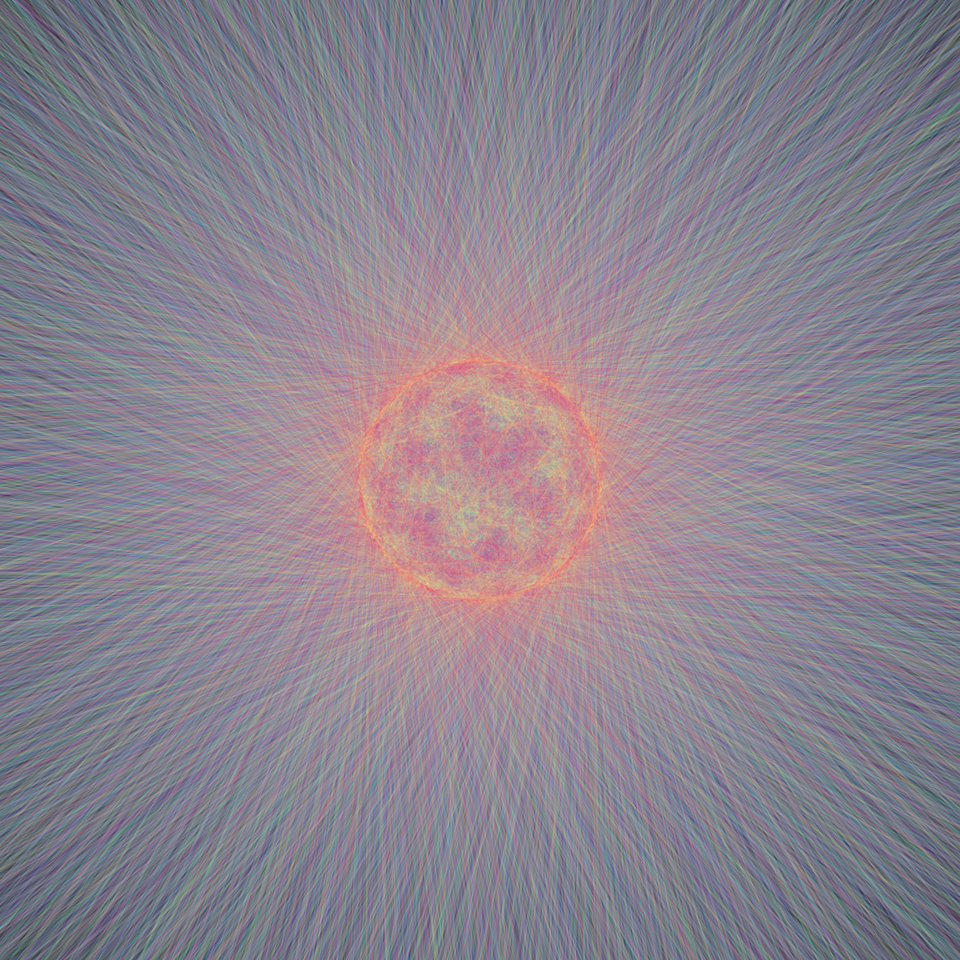

>As in the previous post, this is from drawing lines of high transparency between two "planets" in different orbits, in p5.js.

<cite>by [u/ejgen](https://www.reddit.com/user/ejgen/) in [Reddit](https://www.reddit.com/r/generative/comments/jqq54t/miasma/)</cite>

### All seeing eye

>I continue to draw high-transparency lines between planets orbiting stars that are also in orbit. Here I am using a color map that changes with the distance between the planets. In p5.js

<cite>by [u/ejgen](https://www.reddit.com/user/ejgen/) in [Reddit](https://www.reddit.com/r/generative/comments/jsgdgk/allseeing_eye/)</cite>

### The past was once the future

>More studies of drawing lines between planets orbiting suns which are themselves in orbit. It is a complex system that sometimes generates vastly different forms with small parameter changes and other times produces small variants over a wide range of parameters. In p5.js

<cite>by [u/ejgen](https://www.reddit.com/user/ejgen/) in [Reddit](https://www.reddit.com/r/generative/comments/jtcm2a/the_past_was_once_the_future/)</cite>

### Alien heart

>Drawing high-transparency lines between planets orbiting suns that are themselves in orbit. In this, one of the orbits is a very high radius compared to the others, creating linear forms. IN p5.js

<cite>by [u/ejgen](https://www.reddit.com/user/ejgen/) in [Reddit](https://www.reddit.com/r/generative/comments/ju82m3/alien_heart/)</cite>

### Needle and the damage done

>More plotting high-transparency lines between orbits. In p5.js.

<cite>by [u/ejgen](https://www.reddit.com/user/ejgen/) in [Reddit](https://www.reddit.com/r/generative/comments/jv0upw/needle_and_the_damage_done/)</cite>

### Twelve flowers from orbit

>Some variations of drawing high-transparency lines between planets orbiting suns which are themselves in orbit. Here I vary the speed and orbital velocity of one planet while holding the other constant to create variants on a flower theme. In p5.js.

>I seem to be stuck in a retro vibe! This https://www.reddit.com/r/generative/comments/j00ovr/soul_mates_2_degenerative_friday/ was compared to a Laser Tag carpet from decades ago.

<cite>by [u/ejgen](https://www.reddit.com/user/ejgen/) in [Reddit](https://www.reddit.com/r/generative/comments/jvzhgw/twelve_flowers_from_orbit/)</cite>

### Five candles for peace

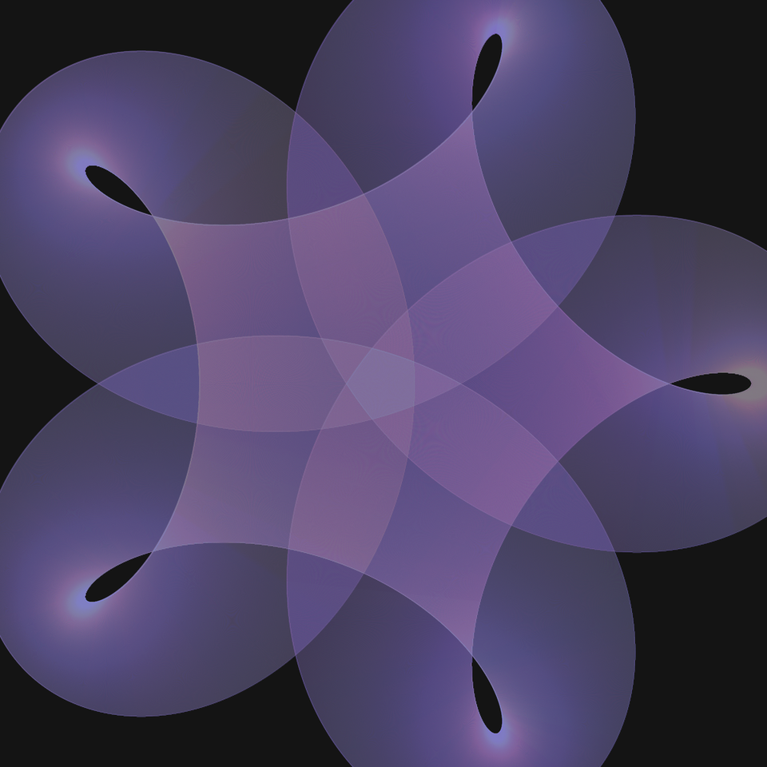

>I continue to draw high-transparency lines between planets rotating suns that are themselves in orbit. Here I make the amazing conceptual breakthrough that the planets can rotate in opposite directions :-) so some new shapes are available. In p5.js

<cite>by [u/ejgen](https://www.reddit.com/user/ejgen/) in [Reddit](https://www.reddit.com/r/generative/comments/jr7os2/five_candles_for_peace/)</cite>

## Organic Painting

### Rhythm

>Thanks for the generative art history lesson u/dmitricherniak , always very curious on how techniques emerges 😊and astonished how peculiarly similar the pieces are !
>
>To further breakdown my piece:
>if you follow okazzsp code in tweet and play with noise parameters, beautiful branching like pattern emerges . some of his other artworks also have it.
>The original piece has algorithm for packing circles and rectangle together. i used only circles for packing as i had my own circle packing library https://github.com/shrynx/circle-packing, it follow simple growth algorithm but with lot of flexibility. ( and if you are wondering No! most of my code is never this well documented or structured 😛)originally this was written for a complete different piece and grew over time https://www.reddit.com/r/generative/comments/h15vcq/untitled/
>Following advice from tyler hobbs essays i chose non overlapping flow field starting points using circle packing
>
>Some circles are left empty, kept this stylistic choice from okazzsp and rest are filled with tiny circles. This was inspired from manoloide's mantel https://www.behance.net/gallery/62172035/mantel . Probably my all time favourite generative art piece.
>
>And finally the last piece of puzzle, i tried couple of palettes and settled oncolours from kandinsky's white zig zags.
>
>Hope this gives some insights to explore them further 😀

<cite>by [u/shrynx_1](https://www.reddit.com/user/shrynx_/) in [Reddit](https://www.reddit.com/r/generative/comments/kq59t7/rhythm/)</cite>

### 952147

<!-- 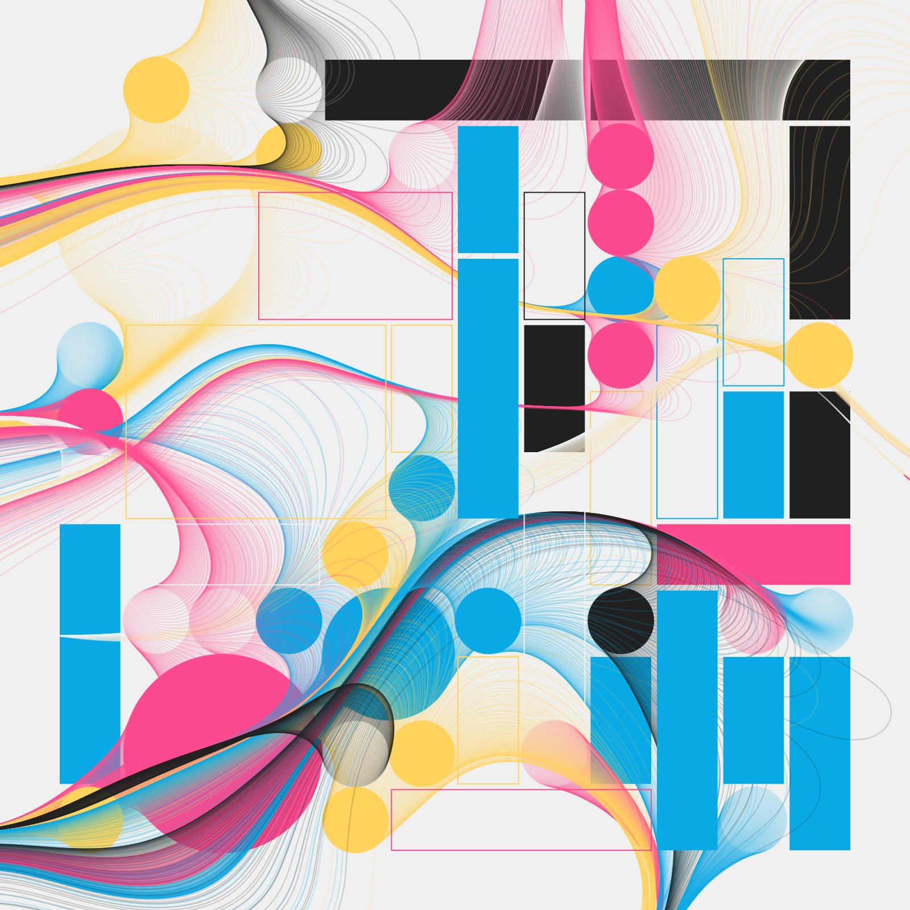 -->
<!-- 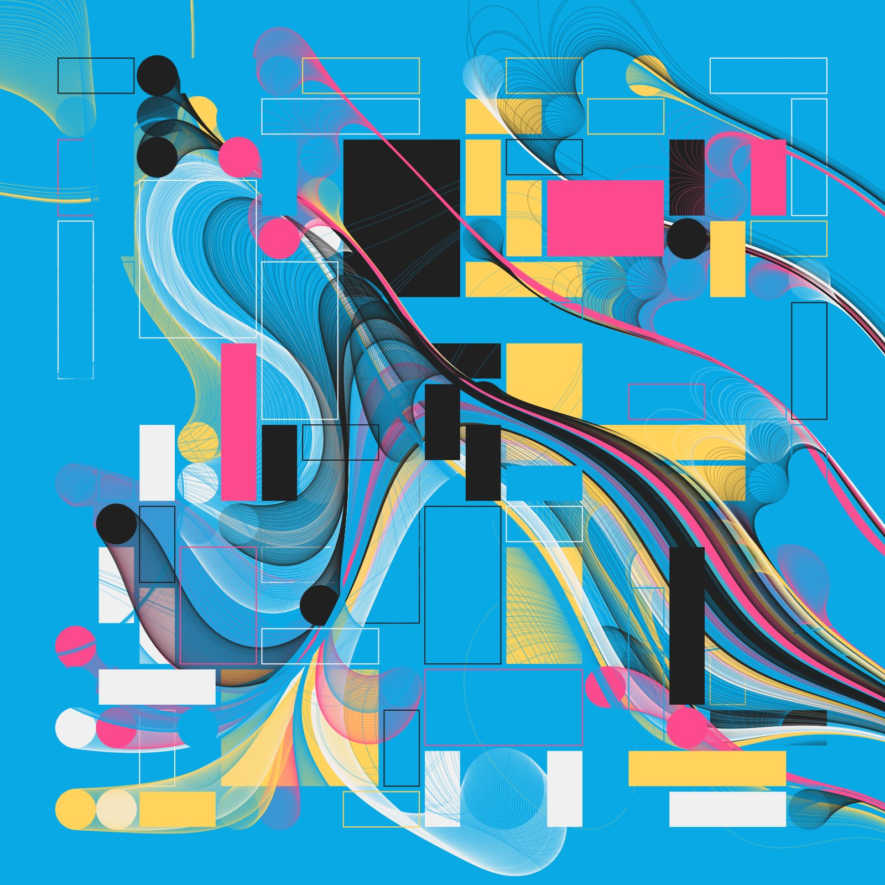 -->
<!--  -->

>#p5js #creativecoding #generative

<cite>by [@okazz_](https://mobile.twitter.com/okazz_) in [OpenProcessing](https://www.openprocessing.org/sketch/952147).</cite>

### The only good thing we got going

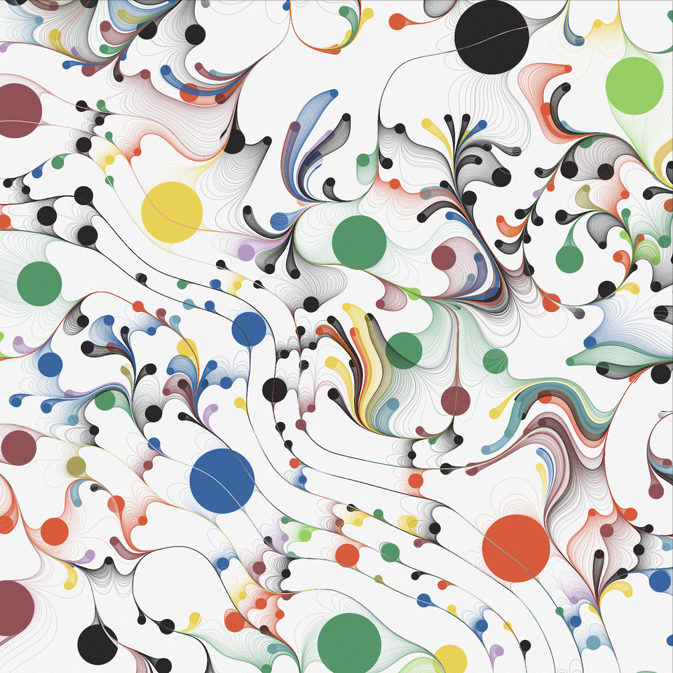

>What's your guess on how it works? I've give you a hint, it uses vector fields as per https://tylerxhobbs.com/essays/2020/flow-fields

>its parameters of the circle packing + an additional element that comes in from the programmatic and statistical coloring that blanks out circles that are the same color as the background. So you'll see some empty spots, and those are because a circle the same color as the bg was original placed there, but then excluded.

>Of course the lines are a function of the noise via the flow fields and the parameters involved there help give it the balance and harmony. Here's some more examples w other colors: https://twitter.com/dmitricherniak/status/1214888292421951488

<cite>by [u/dmitricherniak](https://www.reddit.com/user/dmitricherniak/) in [Reddit](https://www.reddit.com/r/generative/comments/hiwf4i/the_only_good_thing_we_got_going/).</cite>

### Colours & Lines

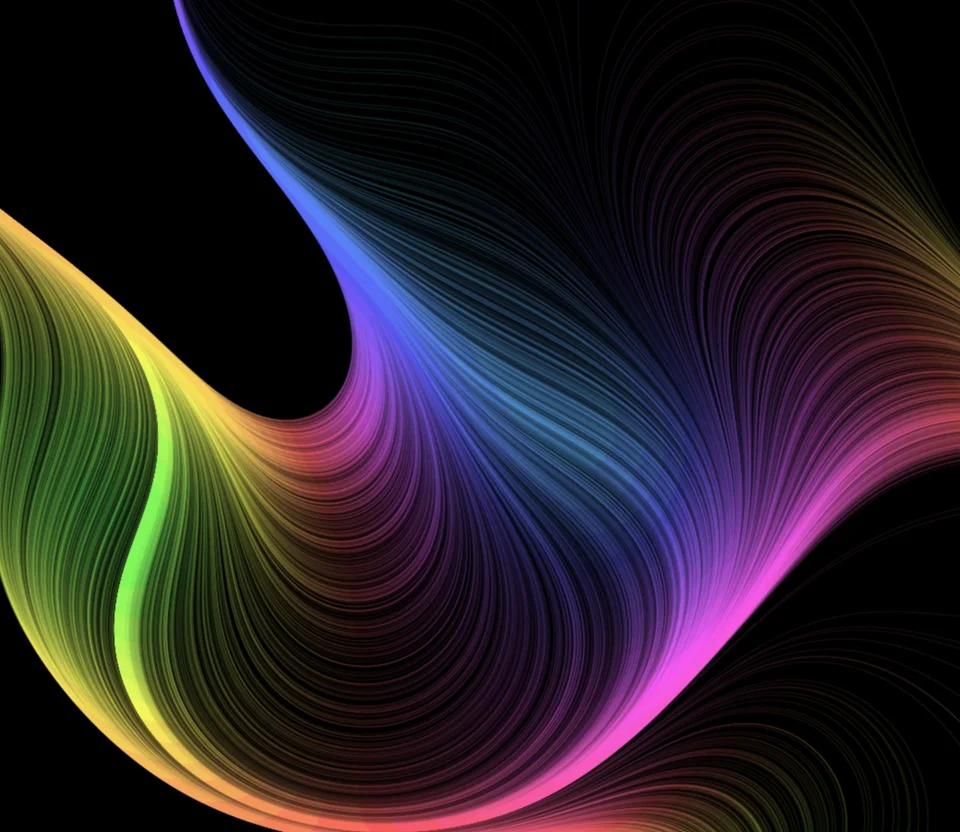

>JavaScript and canvas API with a Perlin noise library

<cite>by [u/marcoangel](https://www.reddit.com/user/marcoangel/) in [Redit](https://www.reddit.com/r/generative/comments/krl93p/colours_lines/giap3li).</cite>

### Flow Field

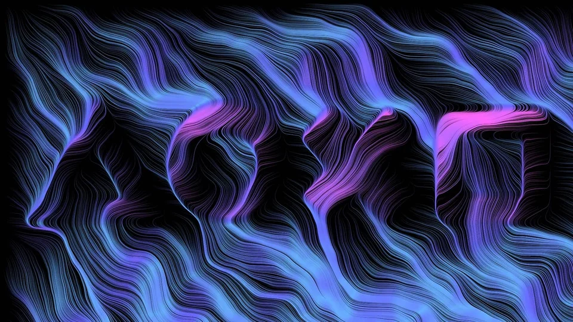

>Recently discovered flow field.. tried to incorporate it over an image along with some noise

>I just superimposed symbols made in Photoshop over the perlin field.. just added the values wherever necessary

>I programmed this on processing IDE

<cite>by [u/silverfuryK](https://www.reddit.com/user/silverfuryK/) in [Reddit](https://www.reddit.com/r/processing/comments/ksh5n1/recently_discovered_flow_field_tried_to/).</cite>

### Genuary 16 (Circles!): I contain multitudes

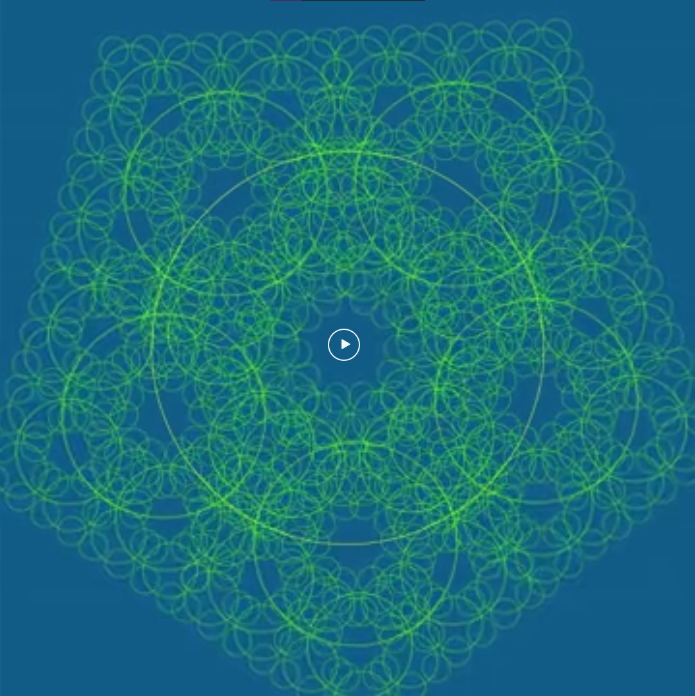

>I draw a circle with 5 small circles around the perimeter, and iterate that 5-deep. The movie is just me increasing the relative size of each level of circles. Most of the action is in the center, where the different circles interact, but there are moments of clarity and almost-clarity in other regions as well. In p5.js.

<cite>by [u/ejgen](https://www.reddit.com/user/ejgen/) in [Reddit](https://www.reddit.com/r/generative/comments/kyb93x/genuary_16_circles_i_contain_multitudes/).</cite>

### Accretion

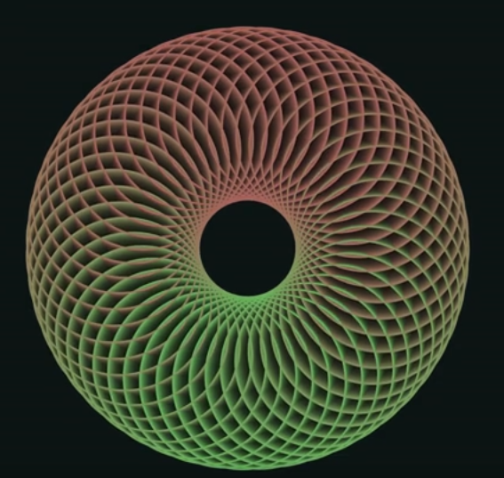

>I draw circles in a circle, and increase the size over time with a little "breathing". In p5.js.

<cite>by [u/ejgen](https://www.reddit.com/user/ejgen/) in [Reddit](https://www.reddit.com/r/generative/comments/l144wu/accretion/).</cite>

### A binary search tree

[no tinc clar que sigui original, però mola]

<cite>by [u/gifsthatendtoosoon](https://www.reddit.com/user/FixHeft/) in [Reddit](https://www.reddit.com/r/gifsthatendtoosoon/).</cite>

### Genuary 23 - when stars collide

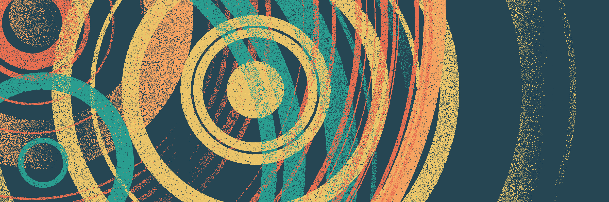

<cite>by [u/jakkodejong](https://www.reddit.com/user/jakkodejong/) in [Reddit](https://www.reddit.com/r/generative/comments/l3id2d/genuary_23_when_stars_collide/).</cite>

### PrologueHaze

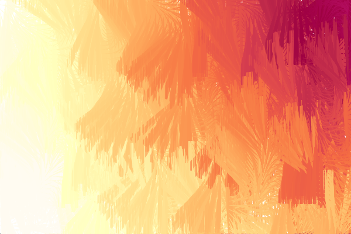

>I'm using a Go lib called gg. But mainly a lot of opacity and many layers.

https://www.reddit.com/r/generative/comments/l7m3i1/prologuehaze/

<cite>by [u/lucid-quiet](https://www.reddit.com/user/lucid-quiet/) in [Reddit](https://www.reddit.com/r/generative/comments/l7m3i1/prologuehaze).</cite>

### Any shape, none can touch (Genuary 2021, day 29 @h.scheidl)

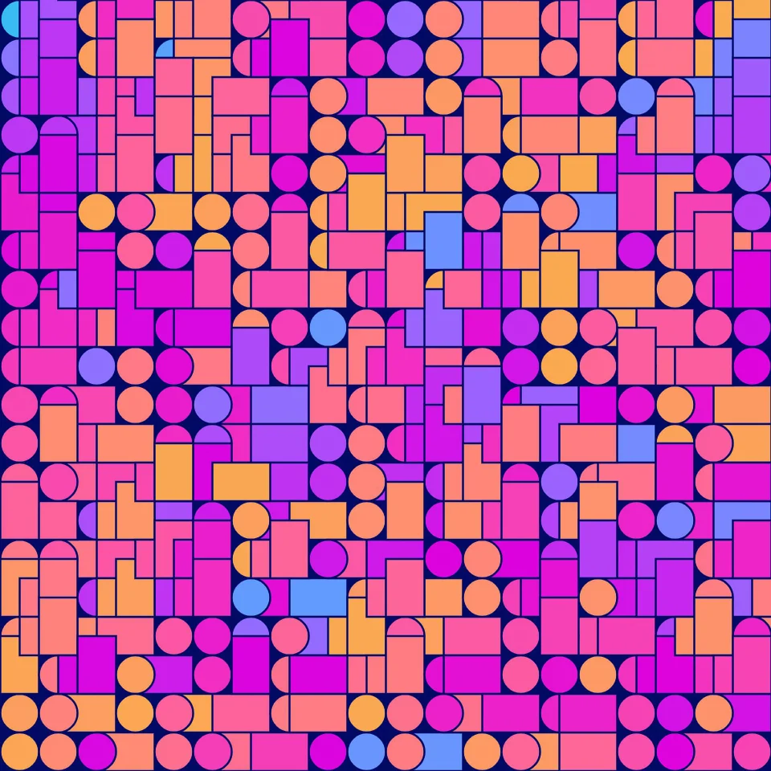

<cite>by [u/Engineering-Design](https://www.reddit.com/user/Engineering-Design/) in [Reddit](https://www.reddit.com/r/generative/comments/l89ej4/any_shape_none_can_touch_genuary_2021_day_29/).</cite>

### One before last, Genuary 2021 day 30!

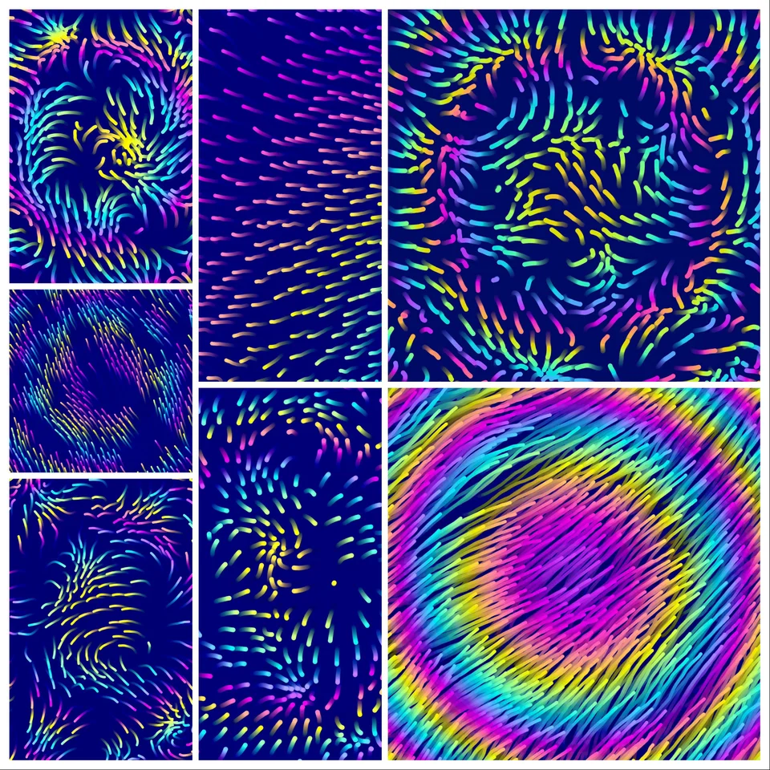

<cite>by [u/Engineering-Design](https://www.reddit.com/user/Engineering-Design/) in [Reddit](https://www.reddit.com/r/generative/comments/l8xfze/one_before_last_genuary_2021_day_30/).</cite>

### Zoomed region of Buddhabrot with high iteration count

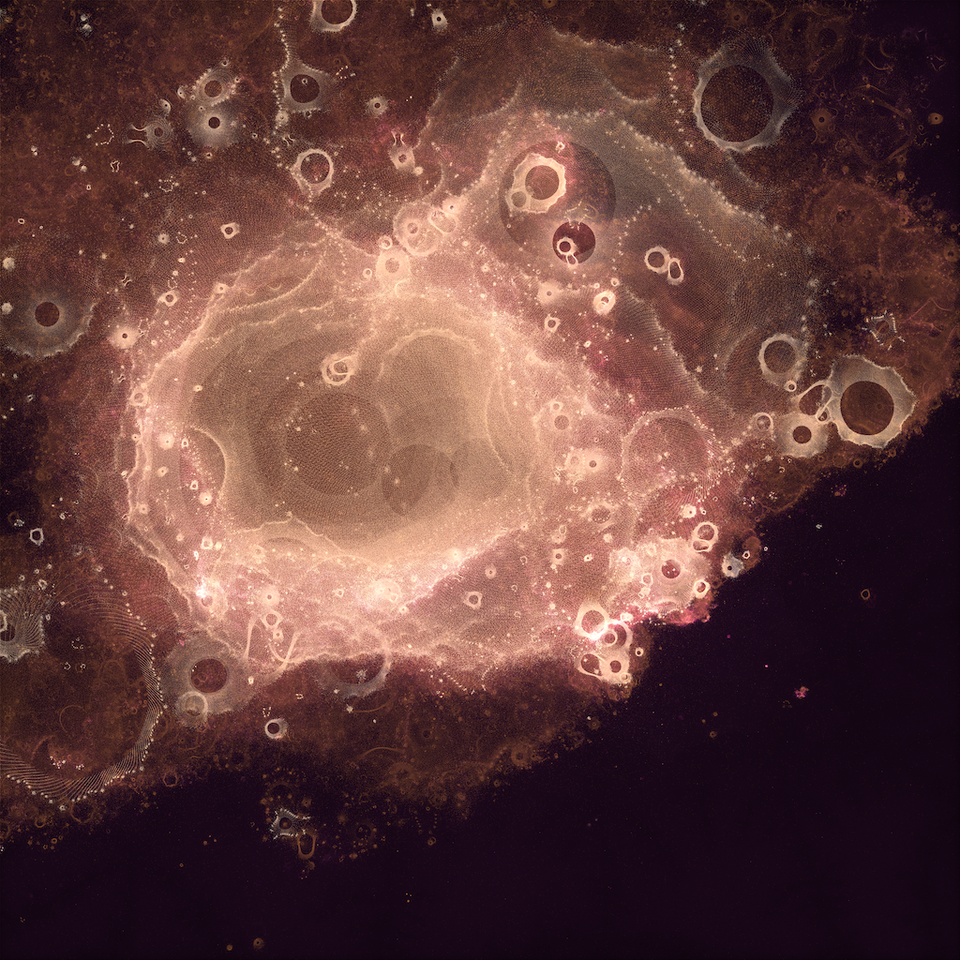

>I used this tool I've been working on: https://github.com/SallySoul/escape

<cite>by [u/SallySouls](https://www.reddit.com/user/SallySouls/) in [Reddit](https://www.reddit.com/r/generative/comments/lanw4d/zoomed_region_of_buddhabrot_with_high_iteration/).</cite>

### [OC] Jellytwist

<cite>by [u/EnslavedInTheScrolls](xxx) in [Reddit](https://www.reddit.com/r/loadingicon/comments/l9n5dl/oc_jellytwist/).</cite>

### bouncing to the beat

https://www.reddit.com/r/generative/comments/la4rtu/bouncing_to_the_beat/

>made with blender and python scripting. music is "Lone Wolf" by CloZinger.

<cite>by [u/selonus](https://www.reddit.com/user/selonus/) in [Reddit](https://www.reddit.com/r/generative/comments/la4rtu/bouncing_to_the_beat/).</cite>

### Fractured Cube (Blender + Python)

<cite>by [u/benmash_art](https://www.reddit.com/user/benmash_art/) in [Reddit](https://www.reddit.com/r/generative/comments/lapmtx/fractured_cube_blender_python/).</cite>

### medley

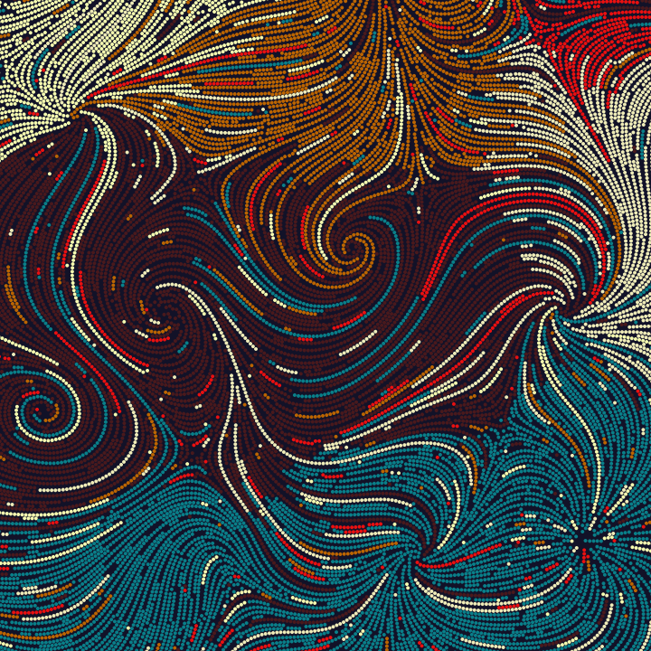

>I make a custom field of vectors (because I was fed up of using perlin) represented by a 2D array. Then I place a particle in it and make it step forward by a length of its diameter in the direction of the field 'cell' it is in. This makes a strip of particles that just touch each other.
>
>Repeat this process, adding a function that checks for collisions before adding a new particle to the list.
>
>Repeat until canvas is filled.
>
>Colours are controlled with a hard coded colour scheme that I generated. I use a process that decides where the main blocks of colour should be with a %chance to pick a random colour from the scheme.
>
>That's the main gist of the algorithm.

<cite>by [u/DeGenerativeCode](https://www.reddit.com/user/DeGenerativeCode/) in [Reddit](https://www.reddit.com/r/generative/comments/ljysrl/medley/).</cite>

### P5JS Multiplication Circles

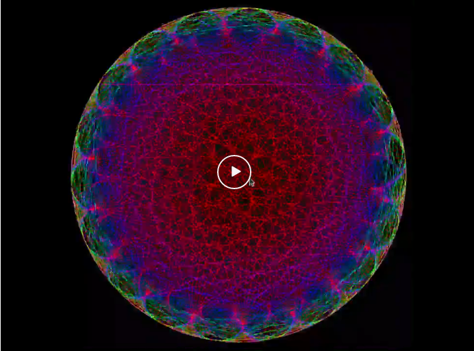

>Link to the video explaining how to make it -> https://www.youtube.com/playlist?list=PLyhIajiyZLlOyAoOV_5SkAM8xSlr2PTvt

<cite>by [u/Rhagaer_Za](https://www.reddit.com/user/Rhagaer_Za/) in [Reddit](https://www.reddit.com/r/generative/comments/m8dpgm/p5js_multiplication_circles/).</cite>

### Still playing with trig & log function

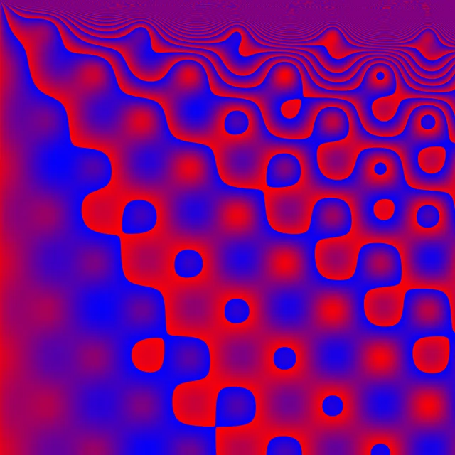

<cite>by [u/alex_kircher](https://www.reddit.com/user/alex_kircher/) in [Reddit](https://www.reddit.com/r/generative/comments/m8cruw/still_playing_with_trig_log_function/).</cite>

### Dividing-Aggregating Walkers - A new technique to generate natural-looking patterns using random walkers

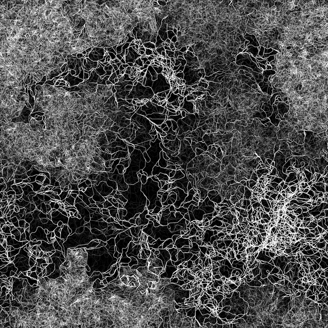

>Really nice ! Yes this is almost the same, at least the core principles are the same ! I think the main difference is on the walking step, in your example, the angle is applied at each iteration to the direction, am I guessing correctly ?
>
>I think my solution tends to produce more "natural-looking" patterns precisely due to the higher potentiel in diversity coming from the way the walking step in handled (the paths tend to look more random-ish).
>
>Nonetheless these are very close ideas, I will link your project at the end of my article since this is a very similar idea, are you okay with that ? It's nice to see that someone has already thought of this technique, as I found it to be quite elegant :)

<cite>by [u/cipheredxyz](https://www.reddit.com/user/cipheredxyz/) in [Reddit](https://www.reddit.com/r/generative/comments/m7cwfx/dividingaggregating_walkers_a_new_technique_to/).</cite>

### Play with Cubes

<cite>by [u/raccoonranger73](https://www.reddit.com/user/raccoonranger73/) in [Reddit](https://www.reddit.com/r/generative/comments/lyzw0v/play_with_cubes/).</cite>

### Phoenix

>We are all made from what came before. I use a combination of logical AND with a very slow tan function. In p5.js

<cite>by [u/ejgen](https://www.reddit.com/user/ejgen/) in [Reddit](https://www.reddit.com/r/generative/comments/lyp1q3/phoenix/).</cite>

### turning inward

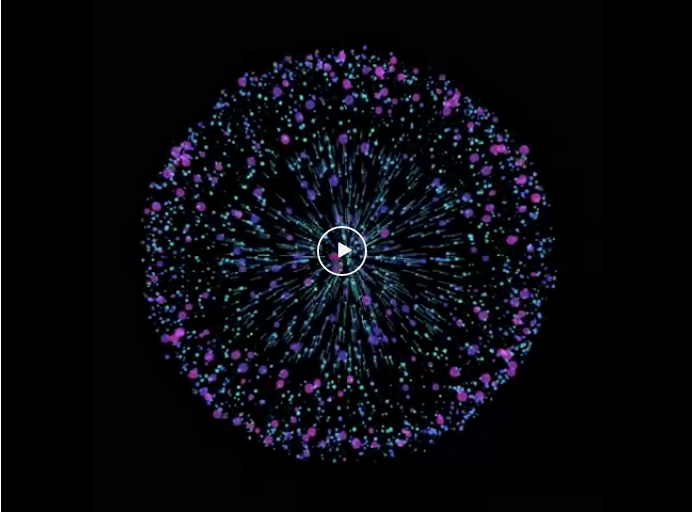

<cite>by [y/2315184](https://www.reddit.com/user/2315184/) in [Reddit](https://www.reddit.com/r/generative/comments/lr8srf/turning_inward/).</cite>

### Orbit trapping the julia set of z = z^2 + c

>I'm using guile scheme with chickadee and GLSL. So I guess I'm quite the exotic one :D

<cite>by [u/Ikosit](https://www.reddit.com/user/Ikosit/) in [Reddit](https://www.reddit.com/r/generative/comments/lrdqge/orbit_trapping_the_julia_set_of_z_z2_c/).</cite>

## Altres

* [Flow Fields](https://tylerxhobbs.com/essays/2020/flow-fields)
* [BLOG INTERESSANT](https://tylerxhobbs.com/)
* [Ego](https://www.reddit.com/r/generative/comments/kvo1h0/ego/)
* [AgateFlower](https://www.reddit.com/r/creativecoding/comments/kyct2w/processing_agateflower/)
* [jan.24 - GENUARY 2021 - Inspired by Daniel Rozin's "Angles Mirror" - Higher resolution example on the webpage. - https://emericw.github.io/genuary2021/prompts/jan.24/dist/](https://www.reddit.com/r/generative/comments/l3z8yt/jan24_genuary_2021_inspired_by_daniel_rozins/)
* [Genuary 24 - Subdivision of a rectangle using 500 lines](https://www.reddit.com/r/processing/comments/l44yrd/genuary_24_subdivision_of_a_rectangle_using_500/)
* [funkyvector.com/#/home/design:Image of the Day 2021/02/11](https://www.reddit.com/r/generative/comments/lhft33/funkyvectorcomhomedesignimage_of_the_day_20210211/)
* [STRÖMMAR-6808-G12. Made with processing.](https://www.reddit.com/r/generative/comments/lhus9b/strömmar6808g12_made_with_processing/)
* [Sketchy voronoi noise](https://www.reddit.com/r/generative/comments/liga8x/sketchy_voronoi_noise/)
* [Pop art meandering river](https://www.reddit.com/r/generative/comments/lfsl8t/pop_art_meandering_river/)
* [suffused](https://www.reddit.com/r/generative/comments/lq3i9r/suffused/)
* [Grooves](https://www.reddit.com/r/generative/comments/lnk558/grooves/)
* [Clouds](https://www.reddit.com/r/generative/comments/lkui7g/clouds/)
* [[OC] Splotchy Sampling](https://www.reddit.com/r/generative/comments/lkio3x/oc_splotchy_sampling/)
* [15.3.21 - what is modular synthesis if not fart noises persevering](https://www.reddit.com/r/generative/comments/m68cm5/15321_what_is_modular_synthesis_if_not_fart/)
* 

<!--
### xxx

>xxx

<cite>by [xxx](xxx) in [xxx](xxx).</cite>
-->