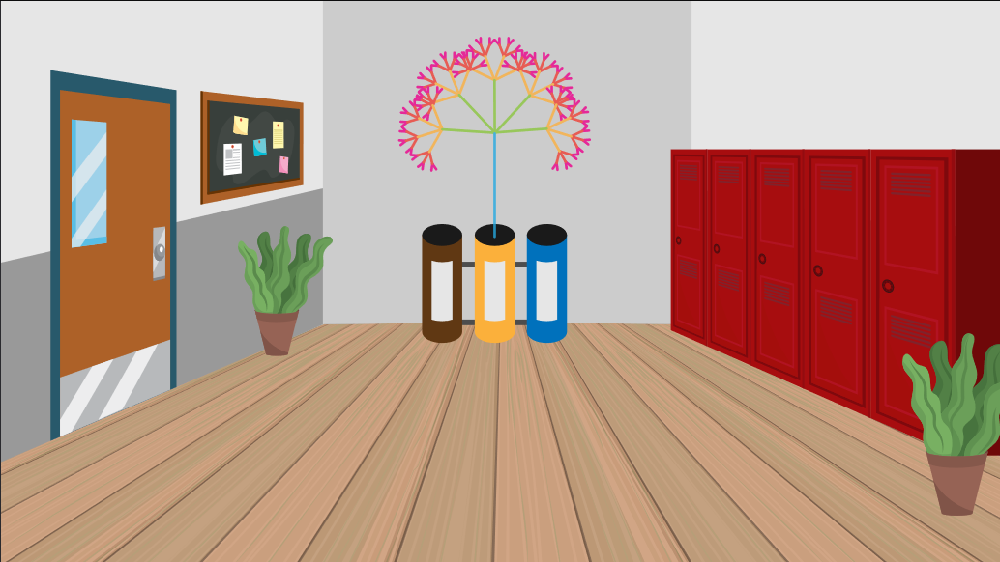
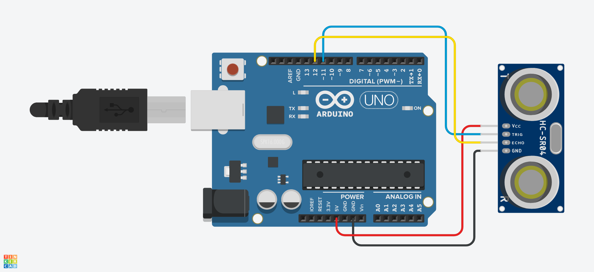

# Arbre Interactiu amb Arduino

<style>n{color:#0080ff;font-family:"Segoe Print"}</style>

Projecte desenvolupat per l'assignatura **Entorns Interactius** del grau en **Multimèdia** de la UVic per: Maria Güell, Xavier Moll i Biel Romaní.

## Idea

Es vol crear un arbre que es desenvolupi cada vegada que algú llenci quelcom a les escombraries.

### Projecció

Es projectarà un arbre a una paret blanca davant de les papereres de reciclatge de la universitat. L'arbre patirà lleugeres transformacions cada vegada que es llanci quelcom a les escompraries.



### Interacció

Quan algú llanci quelcom a les escombreries, l'arbre reaccionarà depenent de la paparera on s'hagi tirat. La següent taula resumeix la interacció:

| Paparera |     Reacció de l'arbre    |
|----------|---------------------------|
| Orgànic  | <n>li surten branques</n> |
| Plàstic  | <n>colors???? </n>        |
| Paper    | <n>L'arbre creix </n>     |

### Estètica

<n>...</n>

#### Musica

La música serà més/menys hostil depenent de la salut de l'arbre:

* **So vent**: https://www.youtube.com/watch?v=zB-Y5OswETY
* **So ocells cantant**: https://www.youtube.com/watch?v=bKRsCZYZAdc

El volum del so del vent es inversament proporcional a la mida de l'arbre. El volum del so dels ocells ha de ser proporcional a la mida de l'arbre. D'aquesta manera, a mesura que l'arbre es fa gran, el so es va fent agradable.

## Detalls tècnics

### Codi principal

L'estructura del programa principal és:

- Inicialització de variables
- `preload()`
- `setup()`
	- Creació del canvas
	- Definició del *framerate*
	- Inicialització de l'arbre
- `draw()`
	- Lectura de *LeapMotion**
	- Assignació de paràmeters a l'arbre
	- Update and Display

### Classe Tree

La classe Tree és la classe que defineix l'objecte principal del programa: l'arbre. Aquest objecte es construeix dins del `setup()` i se li actualitzen els valors atributs principals a cada iteració del `draw()` on també es redibuixa.

Es redibuixa a través del mètode `Tree.drawTree()` que dibuixa una un tronc i les seves branques de manera recursiva.

* Atributs:
  * **size** (*int[2]*): <n>¿?¿?</n>
  * **color** (*int[3]*): el to (*hue*) del tronc. La saturació i la brillentor estan fixades. Cada branca té un to lleugerament inferior al del seu pare.
  * **vel** (*float(0-15)*): la velocitat en que canvia el color.
  * **numBranches** (*int(0-10)*): el número de branques té el tronc. Les filles tindràn una branca menys a cada generació.
  * **angleBetweenBranches** (*float(0-2PI)*): la separació en *rad* que hia entre branques germanes.
  * **colorDiff** (*float(0-20)*): diferència de color entre generacions de branques.
  * **brLenRatio** (*float(0-1)*): proporció de les branques filla respecte la branca mare.
  * **lenght** (*float*): altura del tronc de l'arbre
  * **backgroundAlpha** (*float(0-1)*): transparencia del fons (sembla que deixi un rastre per on passa el moviment).
* Mètodes
  * **update()**: augmenta `color[0]` del tronc depenent de `vel`.
  * **display()**: <n>...</n>
  * **drawTree()**: <n>...</n>

### Circuit (Arduino)

Per poder intereccionar amb l'Arbre des de les escombraries cal sensoritzar els cubells d'escombraries:

#### Circuit



##### Llista de components

| Quantitat |    Component    |
|-----------|-----------------|
|         1 | Arduino Uno R3  |
|         3 | 10 kΩ Resistor  |
|         3 | Photoresistor   |

#### Codi

```cs
//#include <NewPing.h>

//NewPing sensor(11, 12, 200);
int midaContenidor = 20;
int objectNear = -1;
int marge;
int lastDistance;

int readDistance(){
	int echoTime = /*sensor.ping()*/2000;
	int d = /*sensor.convert_cm(echoTime)*/40;
	return d;
}

void checkState() {
	int d = readDistance();
	if(d>0 && d<midaContenidor*3){
		if(d<midaContenidor){
			didObjectPass(0,true);
		} else if(d<midaContenidor*2){
			didObjectPass(1,true);
		} else{
			didObjectPass(2,true);
		}
	} else{
		didObjectPass(-1,false);
	}
}

void didObjectPass(int c, bool movimentDetectat){
	if(movimentDetectat){
		if(objectNear==-1){
			objectNear = c;
		}
	} else if(objectNear>-1){
		Serial.write(char(objectNear));
		objectNear = -1;
	}
}
 
void setup() {
	Serial.begin(9600);
	int d = readDistance();
}

void loop() {
	checkState();
	delay(150);
}
```

### Comunicacio Serie

<n>...</n>

## Referències

* [Idea de l'arbre](https://editor.p5js.org/Lukalot/sketches/H1iMK5tum)